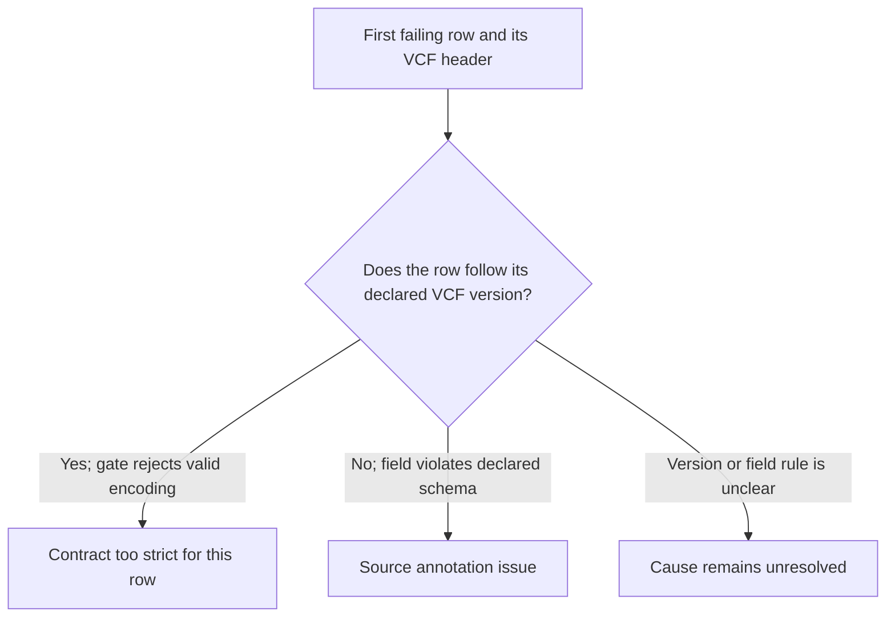

# Released-truth metadata contract audit

Date: October 8, 2026.

Scope: static audit of the metadata checker, truth-unit classifier, their tests,
and the October 7 validation note. No genomic source was opened or parsed. No
test, experiment, code edit, job, Git action, or score was run.

Main's subsequent qualification: the already committed original-source
`truth_header_report.json` declares VCFv4.2 and scalar integer SVLEN; the
preparer preserves raw headers. Thus the 4.5 example below is not the source's
declared format. Main checked the 4.2 specification's signed INS/DEL rule;
the real failed row is still unseen. See the
[prospective census/source note](2026-10-08-metadata-census-protocol.md).
Also, a multi-element list raises `INFO must be scalar` before the signed
guard; it alone cannot produce the recorded signed-length error message.

## Finding

The classifier implements its frozen pure-indel rule consistently. The checker
then applies a stricter `SVLEN`/`SVTYPE` contract than current VCF 4.5 requires
for literal sequence alleles. A standards-valid annotation can therefore fail
this gate. This makes the contract a plausible cause of the recorded failure;
it does not identify the failed row or prove that the NIST source is valid.

## Primary-source comparison

| Source | Primary-source statement | Effect on this gate |
|---|---|---|
| [VCF 4.5 specification](https://github.com/samtools/hts-specs/blob/e821e4f02ae25c2175f9a366edca1322d6a2de72/VCFv4.5.tex), structural-variant INFO fields | `SVLEN` is `Number=A`; it is required for symbolic SV ALT alleles. Its symbolic INS/DEL values count inserted/deleted bases. The spec says to use `.` for other ALT alleles and to treat negative values as positive for backward compatibility. It marks `SVTYPE` deprecated as redundant with ALT. | This checker rejects symbolic ALT, then requires an integer `SVLEN` with `+INS/-DEL` sign for literal alleles. VCF 4.5 does not require that signed value for literal alleles; `SVLEN=.` can be compliant. It also does not require exact `SVTYPE` agreement for resolved alleles. |
| [NIST HG002 v5.0q README](https://ftp-trace.ncbi.nlm.nih.gov/ReferenceSamples/giab/release/AshkenazimTrio/HG002_NA24385_son/v5.0q/NIST_HG002_v5.0q_variant-benchmarksets_README.md), updated July 17, 2026 | The `stvar` VCF has decomposed multiallelic and annotated SVs. The draft set retains complex SVs. NIST recommends paired VCF/BED use, `truvari bench --refine` for representation differences, and review of suspected mismatches. Its “VCF file format” entry is blank. | The README does not specify a VCF version or an `SVLEN` sign/requiredness rule. It cannot establish whether the failed annotation violated its source format. Complex, symbolic, and multiallelic benchmark rows can be valid NIST rows but are outside this classifier's selected unit scope. |
| [Truvari 5.4.0 `VariantRecord` source](https://truvari.readthedocs.io/en/v5.4.0/_modules/truvari/variant_record.html) | `var_size()` takes `abs(int(SVLEN))` when present; without it, it uses symbolic boundaries or the absolute REF/ALT sequence-length difference. `var_type()` checks BND, then `SVTYPE`, then resolved sequence lengths. | Native size removes SVLEN sign. Native type trusts the same `SVTYPE` checked just above. Neither native check independently validates signed `SVLEN`. In this checker, a signed mismatch aborts first, so native checks are not reached. |

The direct example is a literal, sequence-resolved deletion with `SVTYPE=DEL`
and missing `SVLEN` (`.`). VCF 4.5 permits the missing value for non-symbolic
ALT alleles. This checker rejects it because `size` is not the exact negative
integer. This is a standards example, not a claim about the NIST file or failed
row. A source using another declared VCF version must be assessed against that
version; the NIST README does not give it.

## Classifier and test audit

`classify_truth_record()` rejects non-autosomes, multiallelic, symbolic/star,
ambiguous-base, incomplete or unsupported genotype, reference-only, complex
replacement, and events below 50 bp. It trims maximal common suffix then prefix.
It accepts only a pure insertion or deletion: after trimming, exactly one allele
must be empty. The resulting length is the sequence length added or removed.
Static review found no arithmetic or classification defect in this rule.

This helper does not validate REF against a reference, normalize variant
representation, or interpret VCF INFO-field standards. Those limits match its
documented scope. The overreach is in treating its local eligibility rule as a
universal requirement for `SVLEN` and `SVTYPE`.

The synthetic metadata tests encode the same local rule: they require signed
deletion length and reject positive deletion `SVLEN`. They do not test a
VCF-4.5-style literal allele with `SVLEN=.` or absent `SVTYPE`. These tests show
that the code enforces its contract. They do not replicate NIST source behavior.
No tests were run for this audit.

## Failure evidence and limits

The October 7 run stopped with `SVLEN contradicts canonical signed allele
length`. The log gives no row ID, ordinal, or checked-record count. In code order,
the failing row passed eligibility and `SVTYPE`; the `SVLEN` check failed before
Truvari size/type checks. Possible states include missing/dot, wrong sign,
wrong magnitude, or a non-scalar/non-integer value. None is observed here.

The 11,490 prepared rows remain a provisional inventory, not a validated truth
denominator. There is no REF validation, scoring, caller comparison, or biological
null. The gate failure alone proves neither a bad NIST annotation nor an
overstrict rule for that specific row.

## Minimal read-only diagnosis (not run)

No identity was logged. So the smallest way to find the failed row is one bounded
sequential prefix read, from the start through the first failing record, then
stop. Read only the truth VCF header and that record with the pinned standard
parsers. Record only:

- `##fileformat`, and the `SVLEN`/`SVTYPE` header declarations;
- record ordinal, ALT class (literal or symbolic), and allele lengths;
- `SVTYPE`, and `SVLEN` state/type/cardinality/sign/magnitude;
- classifier kind/length and Truvari `var_size()` / `var_type()` results.

Do not emit bases, coordinates, IDs, or genotype values. Do not open reference,
BED, caller, or scoring inputs. Do not repair, filter, normalize, drop, or write
a report. This is annotation diagnosis only; it cannot create a denominator.

This diagnosis needs a separate decision and read-budget reservation. It was not
authorized or run in this audit. It does not reopen the stopped screen by itself.
Main retains protocol/history and artifact metadata. Any strategic decision to
reconsider the route remains separate. No automatic retry, repair, row drop, REF
pass, matching, or scoring follows from this note.

## Evidence class

Primary evidence is limited to the three linked sources above. Repository code
and test assertions are implementation evidence, not independent data
replication. No real source row was observed, and no real-data replication was
performed.
