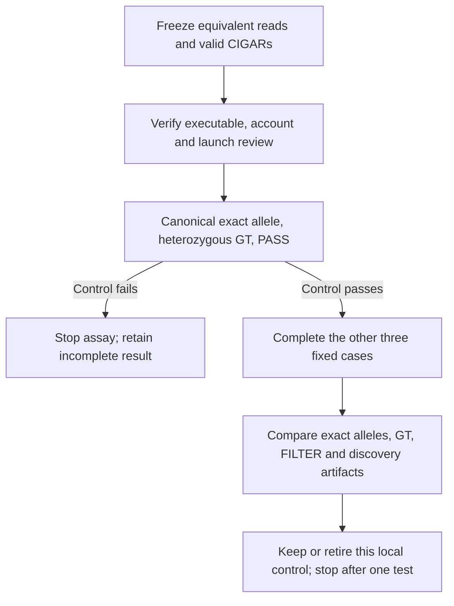

# Native CIGAR invariance: value decision

2026-10-09. **SELECT one bounded diagnostic. Execution is NOT AUTHORIZED by
this note; 256 MiB / 600 named CPU seconds remain UNBOOKED.** This is a
software feasibility decision. It selects no paper candidate or campaign.

Requested configuration for this high-impact decision: **GPT-6.1 Sol / Max
effort**. The full objective requests GPT-6.1 Sol / High for the main
orchestrator, GPT-6 Luna / maximum available effort for delegated work, and
a distinct GPT-6.1 Sol / High reviewer. These are requested configurations,
not independent attestations of the active backend or effort. This decision
does not substitute for independent review of a future launch.

## Why this diagnostic earns one finite test

The consequential unknown is whether a change to valid CIGAR representation,
with the read evidence fixed, changes recovery of the complete allele through
the native caller. The known threshold formula cannot answer this. Assembly,
other evidence paths, genotyping and filtering can erase or preserve the
predicted difference in the CIGAR branch.

One complete four-case result can settle two practical questions: is this
fixture a usable native recovery control, and is any observed loss removable
with an existing native setting? If both default inputs recover, retire the
local loss premise. If the native setting restores recovery, retain that
setting as an existing control; no new rescue method is needed for this
fixture. If the canonical control fails, stop this assay before further
investment. These decisions make the end-to-end observation useful even
though the input was built to cross a known threshold.

Confirming only 60 >= 25, 20 < 25 and 20 >= 5 has no additional scientific
value. A BED hit, a candidate count or a 60-bp length match alone also fails
the selected endpoint. The test must observe exact allele recovery and
native GT/FILTER, together with discovery artifacts.

The [released-callset STOP](2026-10-09-post-diagnosis-value-decision.md) and
its [independent review](2026-10-09-post-diagnosis-value-review.md) remain in
force. Their criterion for a new scientific route is stronger than this
engineering observation. H_R remains UNTESTED; the publication objective
remains unmet.

## The one selected contrast

Use one complete 4,000-base reference: a seeded random 1,000-base left flank,
2,000 A bases, and a seeded random 1,000-base right flank. Insert 60 A bases
before zero-based reference offset 1,500. The frozen ALT haplotype has 4,060
bases. This holds the biological sequence fixed across the three ALT cases;
it is not a repeat-purity intervention.

The concurrently prepared [candidate protocol](2026-10-09-native-invariance-protocol.md)
specifies experiment `native-cigar-invariance-20261009-01`, sample `SYNTH`,
and a 40-REF negative control. Its current fixture source uses seed 1729,
`random.Random`, and successive `getrandbits(2)` selections from `ACGT` for
the left and right flanks. These are read proposal details, not validated
fixture bytes or an approved implementation. Freeze the generator, runtime,
reference, truth haplotype and file hashes before native outcomes.

| Case | Reads | ALT CIGAR / native discovery setting | Role |
|---|---|---|---|
| Canonical default | 20 REF + 20 ALT | One 60I; reporting minimum 35, noise margin 10 | Exact-allele positive control |
| Fragmented default | Same 20 REF + same 20 ALT | 20I5=20I5=20I within the A run; same settings | Representation contrast |
| REF-only default | 40 REF; no ALT | Reference-matching CIGARs; same settings | Negative control at the same total read count |
| Fragmented native rescue | Identical BAM to fragmented default | Noise margin 30; reporting minimum remains 35 | Existing native recovery control |

For the three mixed-read cases, keep query sequence, query length, qnames,
reference endpoints, qualities, MAPQ, flags, read group and valid NM/MD tags
fixed per molecule. Only the 20 ALT CIGARs differ in the primary comparison.
The negative control necessarily changes the molecule set and ALT truth; it
is not part of the same-molecule invariance claim. Forty REF reads match total
depth, not allele composition or an independent biological sample.

Every read must span the repeat and both random flanks. Endpoints may vary
between molecules by the frozen rule; they must agree for each molecule
between compared BAMs. For start `s` and end `e`, let `L = 1500 - s` and
`R = e - 1500`. The ALT CIGARs are `L=60IR=` and
`L=20I5=20I5=20I(R-10)=`. Both consume `e-s` reference bases and `e-s+60`
query bases. Check every `=` against the actual reference and query, not only
the total lengths. A header/dictionary check cannot establish record validity.

Run discover and joint-call over the **entire miniature reference**. Use no
debug target option or target-cluster option. Disable CNV in both stages,
with one thread and the same common settings for every case. Do not use fast
CNV mode. The candidate protocol adds the hidden
`--min-indel-size-noise-margin 30` only to rescue discovery. Freeze literal
commands and resolved settings before launch; the command shape is not a
verified executable contract.

## Source arithmetic versus the new observation

The [full source note](2026-10-09-sawfish-seed-and-target-source.md) reports
Sawfish v2.2.1 source pin `8fdf4cf1b16e366ae8291d4547a1da06affc5c4a` and
the function `max(reporting_minimum, noise_margin) - noise_margin`.

| Source calculation | Known consequence for this CIGAR branch |
|---|---|
| Default: max(35, 10) - 10 = 25 | A 60I can pass the size predicate; each separated 20I cannot. |
| Rescue: max(35, 30) - 30 = 5 | Each separated 20I can pass the size predicate. |

Consecutive I/D operations accumulate; each intervening `5=` flushes the
current group. The source does not sum these three separated insertions into
one 60-bp group. Acceptance still depends on earlier filters and region
intersection. Other evidence paths exist. Neither table row is a universal
locus-seeding cutoff or an observed binary result.

The source-level difference is expected. The useful next empirical result
is the complete native recovery matrix. Margin 30 changes an evidence setting
throughout this run. It is not a proven isolated intervention on one parser
branch. CIGARs can also affect later processing. Even the intended rescue
pattern cannot by itself prove that only candidate seeding caused the loss.

## Required observations and exact interpretation

Retain all records, raw outputs, logs and resolved settings from each completed
stage. Inspect `assembly.regions.bed`, `candidate.sv.bcf`, discovery
`contig.alignment.bam`, `discover.settings.json`, and final
`genotyped.sv.vcf.gz`. Record assembly-region coverage of the declared repeat,
contig counts/lengths, every candidate and final allele, exact-allele counts,
GT, FILTER, and any unresolved record. Native stage markers do not log every
rejected signal. Missing BED/candidate output cannot be labelled "no seed."

An exact literal allele must have a REF that matches the frozen reference.
Applying that record's REF-to-ALT replacement to the whole reference must
produce the complete 4,060-base truth haplotype, including both flanks. Accept
equivalent left shifts in the A run. Do not require the reported insertion
coordinate to equal 1,500. Do not substitute overlap, net length, a symbolic
allele, or a contig length for complete sequence agreement. Preserve symbolic,
multiallelic and otherwise unresolved records as unresolved, not as confirmed
absence. Do not repair calls or combine unphased fragments to manufacture
recovery.

The positive endpoint requires an exact final literal allele, explicit PASS,
and a diploid heterozygous GT for `SYNTH` with one reference and one matching
ALT allele; either allele order and either phase separator are admissible.
An exact allele with a wrong/missing GT or a non-PASS FILTER is a separate
observed failure. The negative control requires zero exact +60-A alleles in
discovery and final output; retain filtered or reference-genotyped candidates
when checking this strict control. It supplies one fixture-specific check,
not a false-positive rate.

| Complete observation, with integrity and negative control passing | Decision and boundary |
|---|---|
| Both default cases meet the positive endpoint | Reject whole-pipeline recovery loss on this fixture. Stop this local loss premise; do not seek a harder fixture within this test. |
| Canonical passes; fragmented default fails; rescue passes | Establish local CIGAR sensitivity and sufficiency of this existing setting on the fixture. Keep native margin rescue as the control. Stop; no method or campaign follows. |
| Canonical passes; fragmented default fails; rescue also fails | Reject sufficiency of margin 30 on this fixture. Stop this proposed rescue assay. Failure does not establish novelty or justify a learned/new generator. |
| Exact allele is already represented in fragmented discovery, but final GT/FILTER fails | Do not attribute that allele's failure to candidate absence. Record a later-stage failure and stop the candidate-loss interpretation. |
| A changed assembly-region pattern accompanies the rescue pattern | Record the stage association. Do not promote it to an exhaustive seed trace or exclusive causal explanation. |

If only one of allele sequence, genotype or FILTER changes, report that exact
component. Do not merge those states into a single "miss" count. Even two
passing final calls establish invariance only for this allele-recovery
endpoint, not equality of all native artifacts.

## Proceed gates and hard stops

Scientific selection is complete. Native execution may proceed only after
all of these gates pass under separately authorized work:

1. Verify the exact executable, its actual bytes/version and compatible
   runtime against the inspected v2.2.1 source. The release digest and tag
   mapping in the [metadata note](2026-10-09-native-tool-metadata.md) are not
   binary attestation. Its sampled inventory does not prove global absence.
   This note authorizes no acquisition, installation or caller execution.
2. Freeze the one fixture, all four cases, literal commands, hashes, output
   evaluator and process containment. Verify record-level validity, unchanged
   non-CIGAR fields, full-reference scanning, reporting minimum 35, and the
   intended 10/30 margins. Distinct code/command review and exact-stack
   synthetic checks remain necessary; no tests were run by this decision.
3. Obtain distinct reviewer scrutiny of this value decision and the exact
   finite launch. The existing post-diagnosis review does not approve this
   new test. Book the complete byte/CPU account before staging or launch.

Stop before launch if any gate fails. Do not infer readiness from a successful
version query or a passing fixture writer alone. Stop during the one attempt
on a changed input, invalid CIGAR, caller failure, missing/unparseable required
output, unresolved-only allele endpoint, or exhausted account. If canonical
exact PASS heterozygous recovery fails, stop the remaining payload commands.
If the REF-only control fails, accept no complete invariance/rescue conclusion.
Mark these outcomes INVALID or INCOMPLETE with the precise reason; they are
not biological nulls.

At most four discover and four joint-call payload commands are available in
one claimed attempt. No retry, threshold sweep, fifth arm, extra reads, changed
repeat length, mapper comparison, whole-genome input or silent continuation
is selected. Preserve failures and full charges. A valid complete result ends
this diagnostic. It may justify retaining or retiring this local control for
a separately reviewed proposal. It does not authorize real-data prevalence
work, a new recovery method, expensive experiments or a campaign.

## Unbooked account

The proposed **256 MiB = 268,435,456 bytes** is a total named byte envelope,
not a RAM limit or a measured physical-I/O claim. Before booking, allocate
tool verification/acquisition if separately authorized, extraction/runtime
allowances, fixture and controls, all input/output reads and posthashes, logs,
failure outputs, and bounded raw/local archival. No acquisition is authorized
here. Freeze output, memory, wall-time and full process-tree CPU containment
with the actual launch. A small compressed tool asset alone does not bound
the complete account.

| Account using the prior decision's retained totals | Prospective value |
|---|---:|
| Retained bytes, unchanged | 40,235,307,915 |
| Retained plus the proposed 256 MiB | 40,503,743,371 |
| Remaining below 64 GiB after that addition | 28,215,733,365 |
| Retained named CPU seconds, unchanged | 556.722707 |
| Retained plus the proposed 600 CPU seconds | 1,156.722707 |
| Remaining below 7,200 CPU seconds after that allowance | 6,043.277293 |

These are prospective calculations from the read ledger, not new reservations
or refreshed measurements. The 600-second envelope covers fixture checks,
all cases and stages, helpers, output inspection and archival. Account for the
waited process tree once; do not add inner timings again. Retain the full
booked byte charge even if the attempt fails or stops early. No old charge is
refunded and no unbooked screen margin is transferred. If a complete bounded
launch cannot fit, stop rather than silently raise the cap.

## Scientific and read-scope limits

The [prior-art note](2026-10-09-native-fragmentation-prior-art.md) records
TRsv's same-read fragmentation and motif-aware merging. The
[native-control note](2026-10-09-native-control-source-check.md) records
Svirlpool v3's repeat-annotation seeding and local consensus. These bounded
source readings rule out treating generic fragmentation or native rescue as
a new contribution. They do not prove exhaustive prior-art coverage.

This deterministic, error-free A-run fixture supplies no evidence of natural
mapper frequency, real prevalence, repeat-purity causality, biological or
clinical importance, performance improvement, or novelty. No result meets
the full publication goal. No purity, cohort, training or other direction is
ranked or selected here.

Read the full 15-line objective attachment and all five required notes:
207-line post-diagnosis decision, 70-line `post-diagnosis-value-review.md`
(the existing review filename), 100-line fragmentation prior art, 69-line
seed/target source, and 65-line native-control source check. Also read the
full trace-interface and tool-metadata notes, the 138-line candidate protocol,
the current PROGRESS opening, and limited fixture-source passages. The other
worker's implementation and tests were not audited or run. Source facts here
are recorded findings in those local notes, not a fresh primary-source audit.
The user-supplied AGENTS instructions apply; no additional AGENTS.md existed
at the checked ancestors or `docs`/`docs/research` paths.

Objective SHA256:
`624de4ace478d0476cc8d899197c61db22a32c55543edb61f79ac7e9bd4145a0`.
Candidate protocol snapshot SHA256:
`0526d5772824705357502f2149d18daf3ba0a4083953aa2baab2854efd247a58`.
That snapshot is a proposal read, not a pin on a later worker revision.

Only this assigned decision note was created. Existing files and concurrent
worker files were preserved. No external research, data download/read,
SSH, installation, native caller, test run, reservation, commit or push was
performed by this decision task.
