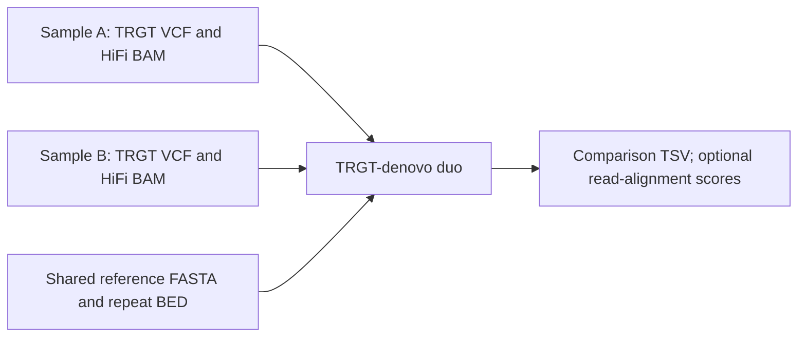

# Paired repeat native check

2026-10-09. Bounded source check for the fixed HG008 tumor-normal repeat
comparison. This note does not validate any HG008 event or approve a run.

## Decision

**Current TRGT-denovo duo is a plausible but unverified ordinary control.**
Its current official documentation supports comparisons between two samples.
It does not establish a tumor-normal somatic interpretation, cross-sample
haplotype matching, or tumor copy-state handling. Keep it as a candidate for
the already-defined M1 review; do not mark the control ready from this check.

The preprint's evaluated trio workflow is **not applicable as-is** to a
matched tumor-normal pair. It compares a child with both parents to detect
inherited-versus-de-novo differences. The current duo mode is a newer,
separately documented capability, so the trio-only paper is not a reason to
reject the pair mode.

The docs do not say that A and B must be tumor and normal. They also do not
say that the comparison preserves the same inherited haplotype after tumor
copy-number change.

## Evidence

| Source | What it supports | What it does not establish |
| --- | --- | --- |
| TRGT-denovo preprint, v1 (2024), [PMC record](https://pmc.ncbi.nlm.nih.gov/articles/PMC11275785/) | The evaluated design uses family trios and PacBio HiFi. It compares child repeat alleles and read support with both parents. Its evidence includes read-level allele comparisons and trio metrics. The paper gives starting filters of at least 5 de-novo reads, allele de-novo ratio at least 0.7, child ratio 0.3–0.7, and reads supporting each within-sample haplotype. | Tumor-normal tissue comparison or somatic copy-state adjustment. These trio ratios must not be transferred as tumor thresholds. The paper notes mosaicism and somatic instability as possible sources of de-novo evidence. |
| Current official [TRGT-denovo repository](https://github.com/PacificBiosciences/trgt-denovo) | The page reports v0.4.0 and latest commit `13805daf9b6b22b0e9934bb8c53fd743771e0337` dated 2026-10-01. It describes both parent-child trios and 1:1 comparisons. | A tumor-normal validation claim. The README lists cross-sample haplotype matching with flanking variation as ongoing work. |
| Current [CLI documentation](https://github.com/PacificBiosciences/trgt-denovo/blob/main/docs/cli.md) | The `duo` command is for two individuals. Each sample can supply a prefix or a VCF plus BAM. Both use a reference FASTA and repeat BED. The tool writes a TSV and can write per-read alignment scores. The documented `--p-quantile` default keeps the top-scoring alignment. | Tumor/normal roles, somatic status, copy-state inputs, or a calibrated somatic probability. The CLI page was fetched from mutable `main`, not from a pinned CLI revision. |

## Applicability to M1

The current duo interface makes TRGT-denovo more relevant than a trio-only
reading of the preprint suggests. It is a reasonable native control to assess
if the fixed HG008 samples have compatible HiFi reads, TRGT genotypes,
reference, and repeat definitions. Those exact inputs and assay versions
were not checked here.

Cross-sample allele identity remains the key uncertainty. The repository
marks flanking-variation haplotype matching as ongoing. A duo result must not
be treated as proof that a tumor allele changed on the corresponding
inherited normal haplotype. The inspected docs also give no tumor copy-state
or subclone-aware interpretation. These points matter for the exact-allele
and normal-mosaicism requirements already set for M1.

TRGT itself supplies per-sample repeat genotypes and reads to TRGT-denovo; the
evidence inspected here does not identify a separate directly linked native
tool with a validated tumor-normal somatic repeat contract. No broader method
survey was done.

## Read scope and limits

I used the Firecrawl plugin, not its CLI. I inspected three distinct primary
pages: the PMC preprint, the official TRGT-denovo repository, and its CLI
documentation. The PMC full-page retrieval was long; I used the abstract,
trio results and targeted methods passages. Firecrawl's paper-index reader
returned no full-text passages. I did not read the supplement, inspect source
code, check a binary or run the method. The current repository page showed
v0.4.0 and its latest commit; the CLI page itself was not pinned to that
commit.

No genomic case files, VCFs, BAMs, truth data, caller outputs, acquisition,
cluster, jobs, bookings, models, credentials, or other project files were
opened or changed. This note is the only file written for this check.
