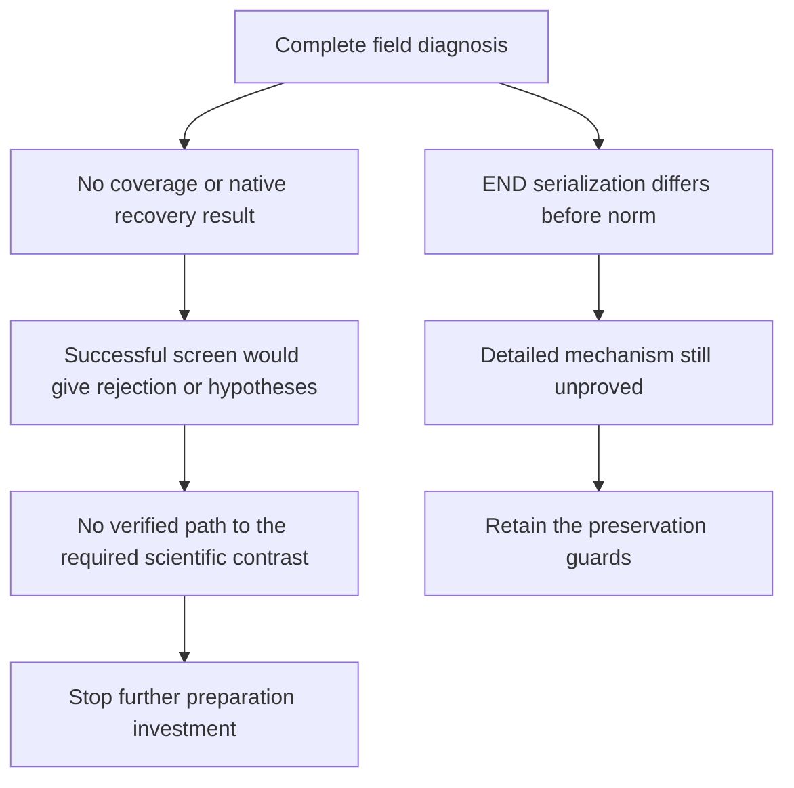

# Post-diagnosis value decision: stop this released-callset route

October 9, 2026. Requested high-impact role: GPT-6.1 Sol/max. Actual backend
model and effort are not independently attested. This is a scientific
investment decision, not execution approval.

## Decision

Choose **A: decline further preparation investment and retire the current
generic released-callset route**. The immediate action is STOP. Do not start
another END diagnosis, representation revision, all-six preparation or screen
to finish this archived development test. Retain its sources, partials,
reports, tests, failures and full charges. The wider publication goal remains
active and unmet.

The governing question is: **if the proposed work succeeds, is its result
important and publication-worthy?** For the presently specified route, no.
Successful preparation would enable a coverage rejection test or a residual
hypothesis list. It would not establish a distinct native failure mechanism,
recover a read-supported allele, or supply independent confirmation. Those
were already required by the [completed throughput decision](2026-10-08-empirical-throughput-decision.md).
The new END evidence improves our explanation of an interface failure. It
does not increase the scientific reach of the screen.

This rejects the next investment, not the unmeasured hypothesis. **H_R remains
UNTESTED.** No score, biological null, caller performance gain or publication
contribution is inferred. The original all-six preparation stays **CLOSED
INCOMPLETE**; unused caller slots do not become a new opportunity to execute.

## What the evidence establishes

| Evidence | Established scope | Remaining limit |
|---|---|---|
| Preparation job 1604204 | All 48 controls passed, zero skips. First cuteSV preparation stopped at the `norm` preservation check. Source/ALT counts and identity fingerprints agreed. | The other five callers did not run. Whole-field preservation, sorting and native views did not complete. |
| Read-only diagnosis job 1604205 | All 51,561 rows joined the pinned source to the current annotated and split artifacts. Source-to-annotated and source-to-split each have 48,286 differences in `serialized_END` only. Annotated-to-split has zero differences; its two current full-file hashes match. | END presence, token removal, numerical value, spelling and affected variant types were not reported. Current partial hashes cannot authenticate original failure-time bytes. The derived file was not inspected. |
| Other frozen projection fields | `stop`, coordinates, alleles, ID, QUAL, FILTER, other INFO, FORMAT, GT and phase have no observed differences in this diagnosis. | Equality under this projection is not raw lexical preservation, biological validation or proof of every representation property. |
| Float controls | Ordinary synthetic serialization can change parsed Float values while standard row text stays identical. | No Float difference was observed in the actual diagnosis. This witness does not explain its END attribution or justify a Float tolerance. |
| Local END controls | On pysam 0.24.1 / HTSlib 1.24, redundant END disappeared for the two literal INS/DEL fixtures while `stop` and other projected fields stayed equal. Symbolic END was retained; changing symbolic END changed `stop`. | This is a six-record toy, not the pinned pysam 0.24.0 / HTSlib 1.23.1 END reproduction or proof of the 48,286 actual token deltas. |

The [actual preparation result](2026-10-08-caller-preparation-result.md) and
[independent failure review](2026-10-08-caller-preparation-review.md) preserve
the original stop. The [diagnosis protocol](2026-10-09-projection-diagnosis-protocol.md),
[result](2026-10-09-projection-diagnosis-result.md) and
[independent review](2026-10-09-projection-diagnosis-review.md) support only the
bounded localization. The review was pending at this decision request; its
final actual-result addendum now accepts technical completion and limited
field localization. It supplies no cause or next-stage approval. Pending
strings in earlier checkpoints are historical tracking, not a second slot.

I read and hash-checked the local 1,474-byte metadata report,
[diagnosis.json](../../results/data_audits/svpg_2026/2026-10-09/projection_diagnosis01/raw/diagnosis.json):
SHA-256 `02d9b6b049134be8ea76b9ecbbf3bcdd80e203a57f1628b6a274d4370295e83e`.
I did not reproduce its genomic comparison. The
[END note](2026-10-09-end-serialization-controls.md) and complete END/Float
test sources were read, not rerun. The END test permits an empty witness
list; its pass alone is not the reported positive serialization observation.
Keep that observation tied to the note's recorded local stack and fixtures.

## Why another preparation pass has low scientific value

The [October 7 novelty recheck](2026-10-07-novelty-recheck.md) and
[October 8 payoff audit](2026-10-08-empirical-payoff-audit.md) record close prior
work on benchmark dependence, joint local comparison, caller integration and
low-complexity misses. Their primary-source inspection limits still apply:
some entries reuse earlier readings, some retrieved text was partial, and
SVkhor was checked at abstract scope. These ledgers challenge the generic
proposal. They do not prove that all possible new mechanisms are exhausted.

The problem is the present experiment's inference boundary. Shared header
paths and reference dictionaries do not establish identical raw reads,
historical reference bases, graph membership or executable versions across
all six callers. Final released calls do not expose native candidate traces.
Q100-added territory is a benchmark coverage change, not a demonstrated
mechanism or an intrinsic difficulty label. Even a perfectly prepared screen
cannot resolve those distinctions.

| Possible completed screen outcome | Decision value | Publication value under this design |
|---|---|---|
| Zero eligible union residuals | Reject this archived recovery motivation under its optimistic matching scope. | No new method, biological null or proof of error-free callers. |
| Nonzero residuals | Supply candidates for later investigation. | No validated biological misses or controlled candidate-generation failure. |
| Incomplete or unresolved comparison | Record a feasibility limit. | No positive or negative biological outcome. |

The frozen local checks also use POA with `-p 0`; their endpoint is geometry
compatibility, not exact sequence truth or read recoverability. More parser
success cannot change that endpoint. The screen could still be useful as
development evidence, but its remaining information value does not justify
another full preparation pass followed by an uncosted screen. This judgment
does not depend on recovering sunk costs or on calling the technical problem
unfixable.

## Disposition of the alternatives

| Choice | Decision |
|---|---|
| A: stop further preparation | Selected. Preserve the diagnosis and retire this generic archived-callset screen as the active route. |
| B: one representation revision, then all-six kill test | Declined on scientific value. Redundant-END equivalence may be a defensible interface rule, but current actual token deltas and pinned END behavior remain unproved, and a successful revision still enables the same weak estimand. |
| Stronger native mechanism test with existing infrastructure | Not selected. The recorded repeat-purity/native-evidence hypothesis has no verified executable candidate-trace and recovery-control path ready for this task. Sampled missing tool paths are not an exhaustive installation inventory. No new pipeline is assumed. |

Source correction supplied by main during this decision: the retrieved
[Svirlpool v3 methods excerpt](https://www.biorxiv.org/content/10.1101/2025.11.03.686231v3.full),
section 2.1.2, appends annotated tandem-repeat intervals as additional seeds.
The supplied history reports v3 posted June 29, 2026; Exa's January 1 indexed
date is not that posting date. The earlier v1-only payoff framing must not
support a claim that consensus callers can never seed loci without strong
indel signals. Main's Sawfish guide search snippet names
`assembly.regions.bed`, `candidate.sv.bcf` and `contig.alignment.bam` as
discovery outputs. These document an upstream trace interface. They do not
verify installation, a runnable local pipeline, a causal absence test or a
stronger selected experiment. These are main-reported source observations,
not additional source reads by this decision task. No completion of main's
separate pinned source check is needed for this STOP decision.

No END-equivalence policy is adopted. Keep the current END and Float guards.
Do not ignore all END tokens, accept value changes because `stop` agrees,
add rounding tolerances, repair fields, or drop rows/callers to obtain a pass.
The local toy demonstrates a possible contract issue; it cannot declare all
actual END differences harmless. Engineering success alone would not reverse
this investment decision, even if a later pinned toy confirmed that mechanism.

## Full account and the rejected counterfactual

The [current reservation record](../../results/data_audits/svpg_2026/2026-10-09/projection_diagnosis01/reservation.json)
retains the full diagnosis reservation. No historical charge is refunded.

| Named byte account | Bytes |
|---|---:|
| Aggregate ceiling, 64 GiB | 68,719,476,736 |
| Retained after diagnosis | 40,235,307,915 |
| Remaining | 28,484,168,821 |
| Counterfactual complete new preparation using staged sources, original six-caller allowance plus 64 MiB metadata | 22,654,658,263 |
| Counterfactual retained total after that preparation | 62,889,966,178 |
| Counterfactual remaining for every later screen/read/archive allowance | 5,829,510,558 |
| Old future 24 GiB screen margin, UNBOOKED | 25,769,803,776 |
| Excess over 64 GiB if both counterfactual preparation and old margin were carried forward | 19,940,293,218 |

Thus preparation alone can fit; complete preparation plus the old conservative
screen margin cannot. The 24 GiB figure was neither a measured minimum nor
execution approval. A smaller complete screen account might fit, but none is
established here. Do not assert that screening is mathematically impossible,
or count only preparation and leave downstream reads uncharged.

Named CPU retained is **556.722707 seconds** under the **7,200-second** ceiling;
remaining is **6,643.277293 seconds**. Even the old 2,400-second preparation
reserve plus 3,900-second screen margin would total 6,856.722707, leaving
343.277293 seconds. CPU arithmetic alone therefore does not force STOP.
These are named accounts, not measurements of physical/opaque I/O or total
historical project CPU. No new reservation, higher ceiling or campaign is
selected. Additional source-copy costs are excluded only in this explicit
staged-source counterfactual, not refunded from history.

## Conditional gates, not further work orders

Reconsidering this route requires a materially stronger scientific proposal,
not another successful compatibility check. All three gates must be met
before any execution is considered:

1. Identify one consequential native failure with independent allele/read
   support, a verified executable trace interface and a strong native recovery
   control. State the distinct publication claim and how one finite test can
   disprove it. Generic repeat enrichment or a final-VCF absence does not meet
   this gate. No such complete target is established in the read evidence.
2. Freeze a shared protocol before scientific outcomes. If an END contract is
   needed, justify its exact admissible equivalence from the source/standard
   semantics and pinned-stack controls. Preserve the original source and
   identities; explicitly reject nonredundant/symbolic END changes, changed
   `stop` or alleles, Float drift, field repair, missingness imputation and
   selective exclusions. Test both allowed serialization and forbidden
   changes. A contract chosen merely to pass the known mismatch count fails
   this gate. This note supplies no replacement contract or production patch.
3. Obtain scrutiny from a distinct reviewer of scientific value, exact pins,
   commands, controls, one-shot stop rules and the complete prospective
   preparation-plus-test account. Charge failures, posthashes, source/working
   passes, opaque allowances and bounded archival. If a larger budget or new
   campaign is proposed, state its numerical bounds and why the current path
   cannot answer the stronger question. Retain all old charges and ceilings
   as history; approval must precede execution.

These gates do not authorize a genomic reread, preparation, remote test,
installation, training run or another campaign. The immediate disposition
remains STOP; no empirical test is launched by this decision.

## Read scope and handoff

Read the full objective attachment with SHA-256
`624de4ace478d0476cc8d899197c61db22a32c55543edb61f79ac7e9bd4145a0`,
full current PROGRESS/RESTART history and later current-state updates, the
completed throughput decision, preparation result/review, diagnosis
protocol/result/review, local END note and END/Float test sources, novelty
recheck and payoff audit. Also read the historical fixed outcome protocol
and preparation limits to assess the actual estimand and account.

Only this assigned note was created. No real caller/truth/reference body,
SSH, remote experiment, production change, test execution, reservation,
commit, push or merge occurred in this decision task. Preserve every prior
failed stage and the reviewed engineering result. Publication significance
and the broader research objective remain unachieved.
