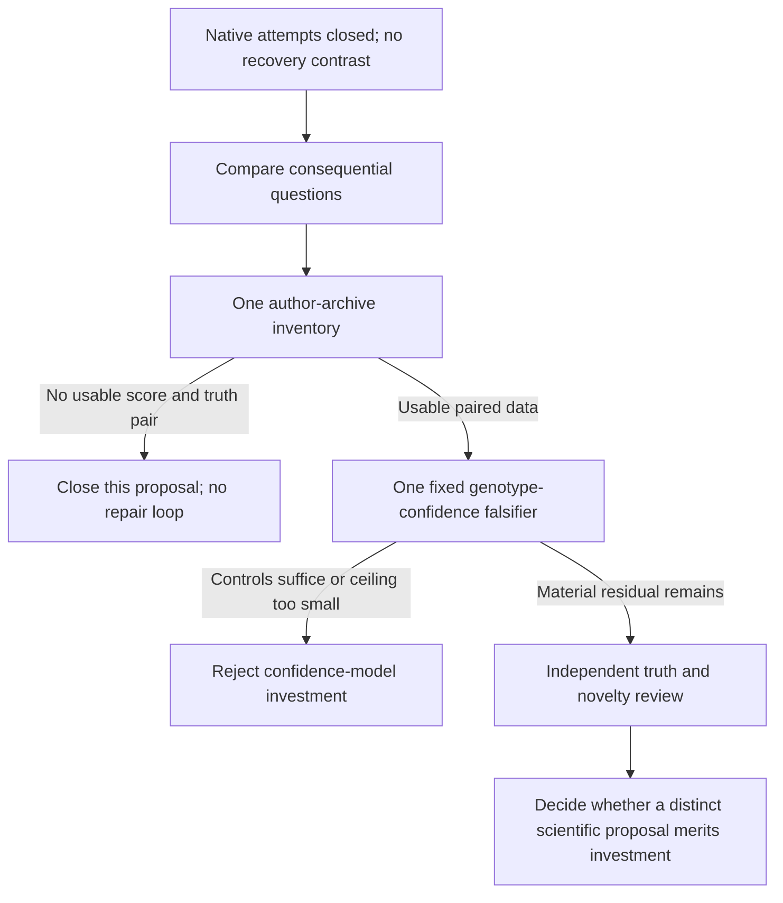

# Post-native investment decision: one empirical falsifier, no paper lead

2026-10-09. Requested decision configuration: GPT-6.1 Sol / max effort.
Backend model and effort are not independently attested. This note selects a
scientific question for one development falsifier. It approves no acquisition,
implementation, booking, caller run, new method claim, or campaign.

## Decision

Retire further investment in the failed native fixture. Keep attempts 01 and
02 closed. Keep the generic six-released-callset route stopped and H_R
UNTESTED. Neither native failure is a biological null. DeepSV remains excluded
as a scientific foundation; SSL has no preferred status.

Select ONE next question for falsification:

> Can confidence selection retain a useful additional fraction of correct
> diploid genotypes at neighboring SVs under a technology change, beyond
> native controls, ordinary recalibration, and the existing neighbor-exclusion
> policy? Or do the fixed genotype outputs leave too little scope for a new
> confidence model to matter?

The cheapest useful test is one analysis of existing scored genotype outputs,
published truth, and an optimistic truth-informed ceiling. Use the author
assessment archive identified below if it contains the required data. Start
with one complete inventory and proceed directly to the frozen empirical
comparison if the inputs qualify. Close this proposal if they do not. Do not
replace a failed inventory with another parser/preparation research project.

This is a decision about the next small measurement, not a selected
publication thesis. **Reject a generic GQ-versus-coverage paper now.** SVUPP
already performs that comparison. Even a large oracle gap would not prove
that a new score can exploit it, that the labels are correct, or that the
result has publication value. Those are separate scientific requirements.

## Native evidence that must remain intact

The [actual result02](2026-10-09-native-invariance-result02.md) and maintained
[independent review, actual02 section](2026-10-09-native-invariance-review.md)
now support **ACCEPT CLOSED INCOMPLETE**. The reviewer checked all 52 payload
hashes, the tiny fixture semantics, resolved settings, complete variant
outputs, stop, and account. I read that complete review addendum; I did not
repeat its raw-file audit.

| Observation | Permitted inference |
|---|---|
| Attempt01 stopped at the managed-path guard before fixture or caller execution | Setup failure; no biological or caller result. |
| Attempt02 passed 78 actual-stack controls with zero skips; canonical discover and joint-call completed | Compatibility for those two canonical commands, not a working recovery assay. |
| Complete candidate BCF and final VCF each contain zero records | Canonical exact PASS heterozygous recovery failed. The other three native arms remain UNRUN. |
| Native metadata records 20 breakpoint observations, one cluster, and one single-region candidate; debug BED records insertion size 60 and evidence count 20 | A blanket no-seeding account is specifically unsupported. These counters do not identify the cause of failed allele emission. |
| Assembly BED is [1499,1500), outside the declared insertion offset; one discovery contig alignment has query length 3060 | Neither the BED boundary nor contig length establishes seed loss or exact haplotype recovery in this repeat. |

Payload 66,500 bytes plus checksum manifest 4,864 bytes totals 71,364 bytes.
All scientific inputs remain unchanged. The source threshold calculation is
still a source fact; no fragmented/default, REF-only, or margin30 recovery
contrast was measured. No depth, repeat, margin, mapper, or fixture repair is
selected. The diagnostic was never a paper lead.

## Competing scientific opportunities

I read Godel's [completed comparison](2026-10-09-post-native-opportunities.md)
in full and main's [primary-source check](2026-10-09-post-native-source-check.md)
in full, including the newer archive metadata. Godel's relative calibration
ranking is useful, but its proposed matched-coverage endpoint is already prior
art. The following comparison uses the corrected boundary.

| Opportunity and estimand | Importance if it works | Closest work and conditional novelty | Current investment disposition |
|---|---|---|---|
| **Germline genotype confidence under transfer.** Wrong diploid dosage among accepted, allele-comparable genotypes, at a declared call coverage and error target; report neighboring loci separately. | Retain reliable dosage information at loci that are otherwise discarded. This can improve research genotype use; clinical benefit is not established. | [SVUPP](https://pmc.ncbi.nlm.nih.gov/articles/PMC12771361/) already ranks by GQ, matches accepted call counts, changes depth/technology, and stratifies neighbors. [kanpig](https://www.nature.com/articles/s41467-025-58577-w) already models SV neighborhoods and evaluates diverse assemblies and depths. A contribution needs useful transfer beyond these controls and ordinary calibration, with sound truth. | Strongest next **falsifier**, because a compact author assessment archive offers a concrete possible data path. No new score or paper selected. |
| **Truth evaluability at complex SV loci.** Fraction of apparent disagreements that encode the same phased structural haplotypes, and fraction whose truth cannot resolve the genotype. | Correct material dosage or method conclusions that current evaluation gets wrong. A small F1 change alone has low payoff. | [vcfdist](https://doi.org/10.1186/s13059-024-03394-5), [ASVBM](https://pmc.ncbi.nlm.nih.gov/articles/PMC12271604/), repeat-aware benchmarks, and the [2026 framework comparison](https://doi.org/10.1371/journal.pcbi.1014824) occupy broad harmonization and metric sensitivity. A gap in complex-event adjudication is conditional, not established by abstract scope. | Do not invest now. Complete phased query/truth haplotypes, confident territory, and a consequential residual are not verified. It is not an automatic fallback if calibration fails. |
| **Low-VAF somatic or mosaic confidence.** Truth probability among emitted calls, conditional on VAF, depth, center, technology, and biological mixture. | Reduce false mosaic diagnoses while retaining supported minority alleles. | Godel's scoped readings of [MIMS](https://doi.org/10.1101/2025.09.18.677206) and its [author resource](https://github.com/BCM-HGSC/SMaHT_MIMS) report physical-mixture benchmarking, 12 pipelines, and read-support modeling. [Qin, Heinz and Li](https://aacrjournals.org/cancerrescommun/article/6/9/2282/788607/Improving-Long-Read-Somatic-Structural-Variant) already filter germline alignment artifacts using personal assemblies and pangenomes. Calibration must add value beyond these strong controls. | Do not invest now. No verified per-call score/truth pair and independent second mixture support the transfer claim. Center replicates of one mixture are not independent biological mixtures. |
| **Genuine off-panel structural alleles.** Error in structural copy state when an independently resolved allele is absent from the panel, rather than merely sequence-divergent. | Detect unsupported structural assignments at medically relevant loci. | [Locityper](https://www.nature.com/articles/s41588-025-02362-4), [ctyper](https://www.nature.com/articles/s41588-025-02346-4), and [COSIGT](https://link.springer.com/article/10.1186/s13059-026-04242-4) already test excluded haplotypes or samples and infer complex genotypes. COSIGT also provides a score-margin uncertainty proxy. | Reject reopening the stopped Locityper confidence route. QV/edit-distance fields do not supply structural panel-absence truth. A new name or graph method does not resolve that label gap. |

The first option wins only as a cheap investment test. The other options have
important possible payoffs but lack a comparably specific, ready empirical
contrast. This ranking does not establish novelty or that any field is
exhausted. Generic fragmentation merging and consensus rescue also remain
occupied by TRsv and the native methods recorded in the
[fragmentation prior-art note](2026-10-09-native-fragmentation-prior-art.md).

SVUPP Methods 2.1 use GQ-ranked genotype discordance, including a matched
70,000-call comparison. Results 3.2 report over 30% discordance for neighboring
SVs despite GQ filtering and omit that category from later analyses. Its
posterior uses a uniform genotype prior and an assumed per-read error of 0.01.
These are reported findings and model assumptions, not this project's
replication. Neighbor errors and GQ-ranked risk curves therefore cannot be
the new contribution. The probability/transfer question survives only
conditionally. [Primary methods and results](https://pmc.ncbi.nlm.nih.gov/articles/PMC12771361/).

## One empirical falsifier

### Inputs and finite readiness decision

Use ONLY `SVUPP_paper.zip` from the
[newer author record 17569072](https://zenodo.org/records/17569072):
47,443,427 bytes, publisher MD5 `5469337ca9249691b2b376ceb9b67e1d`.
Main verified official API metadata; I read its report, not the archive.
The description says analysis/assessment code. No member names, scores,
truth vectors, masks, or complete joins are verified yet. The older
article-linked record supplies source/pipeline archives and a container;
a paper's data link is not proof that assessment genotypes are available.

The one next empirical action is: **acquire and inventory this one archive;
if it contains the qualifying paired data, analyze those complete data once
under the design below.** Do not execute bundled code. Do not acquire the
container, raw BAMs, another benchmark, or the larger Locityper database to
make this test possible.

Require scored per-genotype outputs for SVUPP and kanpig, the exact published
truth GTs and catalogue/reference identity, eligibility/callability information,
sample IDs, and technology/depth metadata. Require ONT ultra-long and HiFi
slices with a valid common allele basis. Native flags, read depth and allele
support must be usable where the native control requires them. Aggregate
curves, figure coordinates, summary QVs, or code alone do not qualify.
If either score/truth identity or the chosen technology comparison cannot be
established, close this test **INPUTS INSUFFICIENT** after that inventory.
Do not substitute another caller, easier stratum, or transfer direction.

For development, a verified common forced-call catalogue can support exact
dosage comparison against its published GT labels. Numeric GT equality is
valid only after ALT identity/cardinality and the common allele basis agree.
Phase order is not a dosage difference. Missing GT, omitted rows, unsupported
reference labels, and unresolved representations never become correct calls.
Any uncertain truth remains visible. This is published-benchmark discordance,
not independently adjudicated biological error.

### Estimand, controls and the ceiling

Let E be the fixed, callable, completely labeled autosomal genotype units on
that verified catalogue. Neighboring means another catalogue SV within
1,000 bp. Set this from the input catalogue before querying outcome labels.
Report the whole eligible set and the neighbor stratum; keep all exclusions,
no-calls and unknown labels in the accounting.

For policy b on target technology t:

`R_b,t = wrong accepted GTs / all accepted GTs`

`C_b,t = accepted GTs / all eligible GTs`

The scientific target is reliable exact structural dosage on independent
truth. The development endpoint uses the released labels as an explicit
proxy. Do not describe 1% development discordance as a clinical error bound.

Freeze an error target of **1%** and a minimum useful coverage gain of
**10 percentage points within neighboring SVs**. These are prospective
investment thresholds chosen here, not observations or literature claims.
Ten points is intended to exclude a small score improvement with little
usable dosage benefit. A pass still requires a defensible method and final
validation; the threshold does not make the pilot publishable.

Compare the existing native GQ/flags, the published neighbor-exclusion policy,
one source-fitted global monotone score calibration, and an ordinary control
using score plus depth/allele balance and the same neighbor indicator. Native
GT outputs stay fixed. Include kanpig as a strong genotyping control; do not
pool caller GQs as one probability scale. Its score gap is not SVUPP's
posterior error probability. A monotone map does not improve ranking by
itself. Merely choosing a new point on the known GQ curve is not the payoff.

Also compute an optimistic ceiling for selection on **each fixed caller's**
GTs. On the locked target units, let K be correct usable GTs and W wrong
usable GTs. With alpha = 0.01 and N eligible units:

`C_oracle = (K + min(W, floor(K/99))) / N`

For the fixed 1% target, `floor(K/99)` is the exact integer allowance for
wrong calls. Use integer arithmetic for that count.

This oracle keeps every correct GT and only enough wrong GTs to meet the
finite-set error target. It uses truth and cannot be deployed. It changes
neither GT nor allele. It is an optimistic upper bound for a confidence head,
not a ceiling for a new genotyper. Do not create a cross-caller oracle
haplotype or combine fragment calls to inflate recovery.

Use the maximum of the two separate, whole-stratum caller ceilings to bound
choosing one fixed caller for a future confidence head. This is not a
per-locus union of their correct genotypes. Use the same E and denominator
for both callers and every control. A small ceiling for one caller cannot
reject a head for the other if its ceiling is larger.

**Falsifier:** if that maximum oracle coverage gain over the strongest
qualifying ordinary control is below 10 points in the neighbor stratum,
reject further confidence-model investment on these fixed outputs. No learned selector can
exceed that ceiling under the stated labels and risk target. If ordinary
controls already approach the ceiling, the same rejection applies. Report
control policies that fail the error target; do not conceal them or assign
a vacuous zero-call policy a measured risk of zero.

If no frozen control accepts calls while meeting the target, report that
failure and the ceilings. Do not perform the gain subtraction against a
fictitious zero-risk baseline. An empty eligible stratum is INPUTS INSUFFICIENT.

A larger gap only identifies remaining room. It does not establish learnable
signal, correct truth, biological transfer, a new mechanism, or a new method.
Do not order training from that result alone. If label/representation
uncertainty can move the gap across the decision threshold, close the pilot
INCONCLUSIVE. Its failure is a reason to reconsider the question, not to
retune the metric or continue shopping for labels within this attempt.

### Leakage, uncertainty and final tests

Choose source ONT ultra-long and target HiFi before outcomes. Use fixed locus
blocks for fitting, calibration and target evaluation. Keep all overlapping
or neighboring alleles, relatives' observations, depths, caller outputs and
technology views of a locus in the same block. Fit maps and thresholds on
source fitting/calibration blocks only. Freeze tie handling and all policies
before exposing target labels. Oracle truth is for the ceiling only, never
for features, thresholds or genotype choice.

Show paired locus-block uncertainty and per-donor rates. Reads and VCF rows
are not independent biological replicates. Resampling loci in one pedigree
does not estimate between-family uncertainty. Broad truth missingness is not
random by assumption; report the labeled-support restriction and sensitivity
to unresolved units. An interval spanning the practical rejection threshold
is inconclusive and gives no automatic sample-size extension.

Platinum supplies development evidence here. Its NA12878 technical Revio
cell line was not used to generate the truth set, according to the
[official index](https://github.com/Platinum-Pedigree-Consortium/Platinum-Pedigree-Datasets).
That is useful technical separation, not a new person or family. HGSVC3's
staged joint GT inventory likewise supplies no independent error denominator
by itself. Neither is silently promoted to final truth.

Before any paper claim or expensive campaign, require independent scrutiny
of a specific residual, full structural truth and masks, strong native and
ordinary controls, and a proposed method's incremental usefulness. Final
tests must reserve independent families or unrelated donors, complete locus
families, and the claimed technology/depth transfer. Use exact structural
genotypes with orthogonal adjudication where ambiguity remains. Preserve
missing calls and unresolved labels. Predeclare effect size and power using
the independent units. This pilot provides neither that final set nor a
population risk guarantee. Generic post-hoc calibration alone is insufficient
publication novelty.

## Cost, authority and failure/pivot rules

| Current retained account | Value |
|---|---:|
| Full historical named byte charges | 40,772,178,827 bytes |
| Ceiling / remaining | 68,719,476,736 / 27,947,297,909 bytes |
| Measured named CPU, counted once | 561.292707 seconds |
| CPU ceiling / remaining | 7,200 / 6,638.707293 seconds |
| Prospective falsifier envelope, UNBOOKED | At most 2 GiB and 600 named CPU seconds |
| Prospective total with that allowance | 42,919,662,475 bytes / 1,161.292707 CPU seconds |

The proposed envelope covers archive acquisition/verification, complete
inventory and bounded decoded-data passes, controls, one table comparison,
postchecks and small reports. It is not a physical/opaque-I/O measurement or
a new reservation. Main must check the complete actual pass account against
it. Ordinary process guards suffice; no new general I/O framework is
required. If the one archive or complete useful analysis cannot fit, close
this candidate rather than score a prefix or silently increase the budget.
Charge any failed future booked attempt in full under the existing account
rule. Existing charges are never refunded or transferred from unrun arms.

The remaining budget can support ordinary small jobs. Budget arithmetic does
not force this scientific rejection. The current write-only assignment and
no-native-replay instruction are user boundaries. Earlier universal
failure-stop rules, dates, and preparation heuristics were engineering policy,
not proof that every new SV question is false. The user's broader research
goal allows a pivot; it does not authorize execution by this note. Any budget
amendment must be explicit and reviewed. Independent review must precede an
expensive campaign or acceptance of a major positive result.

| Result of the finite action | Next disposition |
|---|---|
| Archive lacks qualifying scored GTs, truth join or the fixed technology pair | Reject this data path. No archive-format repair loop, native rerun, new container, or bulk-data workaround. |
| Strong native/ordinary policies suffice, or the oracle margin is too small | Reject a new confidence model on these outputs. Do not preserve it by adding SSL or context features. |
| Apparent residual depends on allele representation or unqualified truth | Accept no biological error claim. The complex-truth opportunity needs its own consequential proposal and evidence; it does not start automatically. |
| Material gap survives controls and truth sensitivity | Request a concrete method/measurement proposal and independent scientific review. No automatic training or campaign. |
| Resource/integrity failure or inconclusive uncertainty | Retain the incomplete result and full charges. Close this pilot; no biological null or silent enlargement. |

Realized payoff today is zero new biological or method improvement. The
reviewed native closure is useful evidence, and the selected falsifier can
avoid spending on a confidence model that cannot add usable genotypes.
Publication value remains unmet. Successful inventory, score parsing, nominal
miscalibration, or oracle room cannot be counted as research success.

## Read scope and evidence limits

Read the full objective attachment; PROGRESS and RESTART_STATE openings
(lines 1–210); the complete October8 strategy-reset and three-direction
decisions; post-diagnosis decision/review; native value decision, protocol,
fragmentation prior art, and result01/result02; the complete actual02 reviewer
addendum from line424; Godel's completed opportunities and main's updated
source check. Earlier native-review history was read only in part. Also read
the full October7 opportunities, novelty recheck and filtering-methods audit,
October8 payoff audit, October1 confidence contracts, October4 Locityper
schema gate, and HGSVC3 genotype inventory. These local source reports retain
their own supplement, source and data-read limits.

Fresh external checks used Exa: seven searches requested 47 slots across
panel, germline confidence and somatic controls. Slots are not papers read.
Read selected primary methods/results/data-availability passages for COSIGT,
ctyper, kanpig, Locityper and SVUPP, plus author-resource pages. Qin/Heinz/Li
was checked through primary abstract/search passages and retrieved article
material, not a full methods audit.
Article extraction was capped; figures, supplements and repositories' code
were not audited. Exa's failed COSIGT table-directory fetch was retried with
web access, which also failed; no table-readiness claim uses those failures.
The fetched root README and kanpig truth-release manifest do not establish
a usable scored query/truth pair. MIMS, vcfdist, ASVBM and framework details
reuse the scoped worker/local source readings. No exhaustive novelty claim
is made. Zenodo archive identity is main's official-metadata finding, not
independent acquisition or member verification by this decision.

| Fully read decision inputs | Observed SHA256 |
|---|---|
| Objective attachment | `624de4ace478d0476cc8d899197c61db22a32c55543edb61f79ac7e9bd4145a0` |
| Godel opportunities | `e04ec0bbcd03fc3f20354099ed1117eae2299290640b5f8d767c87e5ea35332e` |
| Main source check, including archive update | `f80748c6d4400f25de80125180933e7c4f099aa4e55ff4302d53d5cdc12147f0` |
| Current result02 note | `09772de875995a07531df8a57162d1a4c800d4241d68c7a3a36ce1255530a6de` |

The maintained review file hash at the actual02 addendum read was
`b23695b1d32490b8e2df0db238a71170115ca00392629aebf3593dec40ae1c2e`.
Godel was requested as Luna/max and the reviewer as Sol6.1/high; neither
backend is independently attested here. Commit/push status is supplied by
main and was not inspected.

Only this owned note was created. No code or other note was changed. No
genomic/archive body, raw native artifact, SSH, experiment, test run, booking,
installation, Git operation, or message to another chat occurred in this
decision task. The one empirical action above is prospective and requires
the main workflow's execution authority; this note does not consume it.
