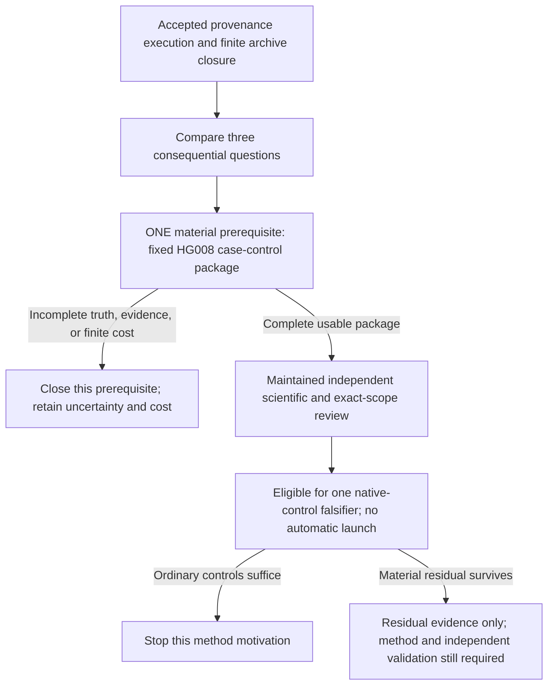

# Post-provenance scientific decision: one material prerequisite

2026-10-09. Requested decision configuration: GPT-6.1 Sol/MAX. The serving
model and effort are not backend-attested. This is an owned investment
decision, not independent review or execution approval.

**Decision: STOP training, new-method investment and campaigns now. Select
ONE bounded material prerequisite for a distinct somatic-SV question.**
Establish a complete paired tumor-normal evidence package for the 16 somatic
tandem-repeat INS/DEL misses reported in the HG008 assembly preprint, with
32 fixed germline-only controls. Its purpose is to make a small native-control
falsifier possible. File presence, an inventory, or a new wrapper cannot pass
this prerequisite. No empirical result is claimed. The publication goal is
still unmet.

The single scientific evidence question that would change investment is:

> Do at least four of these 16 events remain independently supported,
> distinguishable tumor-specific structural changes after current native
> calling and ordinary donor-specific normal-reference controls, with an
> observation that can distinguish them from germline alignment artifacts?

Related prior art does not answer that exact question. Conversely, repeating
a published miss, changing variant representation, or removing a pangenome
filter is insufficient evidence for a new contribution.

## Governing objective and accepted starting evidence

I read the complete [governing objective](/Users/akm/.codex/attachments/2fa04b13-b328-4023-872e-0c4cc9dbfaee/goal-objective.md).
Its measured SHA-256 matches
`74ba6450712e7f0e763cd81de896d3a71ca73f9c4a10fec3f1ecab59b3f1b0b8`.
Scientific significance governs over preservation of SSL, an architecture,
dataset or task. DeepSV remains historical work or a necessary baseline;
it cannot be the foundation. The human resource clarification governs:
use all useful CPU/GPU/RAM/storage capacity efficiently and scale independent
experiments fully.

I read the full completed actual-review append in the
[maintained provenance review](/Users/akm/aayushkrm-AlignSSL/repo/docs/research/2026-10-09-svupp-provenance-header-review.md:99).
Its measured hash matches main's supplied snapshot:
`da5fe15c09a2d1f9e5be9dc75747b764a47304f989b2cfba1b3b1b4a519491cc`.
The reviewer accepts bounded execution, raw preservation and account, and
separately accepts finite archive-path closure as **INPUTS NOT SUFFICIENTLY
ESTABLISHED for the fixed ONT ultra-long→HiFi question**. I did not repeat
the raw verification.

Job1604214 completed; 44 actual controls passed with zero skips. Complete
preservation contains 19 files, including 18 payloads and their checksum,
89,269 bytes. These are accepted limited execution facts. They do not
validate GT rows, reference alleles, callability or biological accuracy.
One view per caller and seven pedigree donors do not establish the fixed
technology pair. The kanpig README version and inherited Sawfish header do
not attest an executed version. The SVUPP fork dependency and cuteSV header
do not resolve its executed version. Mixed truth construction remains a
truth-uncertainty issue, not proof of either unbiased truth or circularity.

Keep this archive route closed. Keep generic released-callset filtering,
Locityper confidence and native fragmentation attempts closed. Preserve all
failures, charges and exposed tests. Their stops do not reject all SV science.
No MIMS calibration or complex harmonizer is promoted.

The completed [retained-input note](/Users/akm/aayushkrm-AlignSSL/repo/docs/research/2026-10-09-retained-input-actionability.md)
was read in full, including main's qualification. I did not repeat its audit.
It reports six staged caller files and a narrow seven-data-path/twelve-tool-
path check. It supplies no independent truth or ready experiment. The
`/data1/huheng/HG002/hifi.bam` string was a publisher-style sample-label field,
not a dedicated retained-read asset. ENOENT there does not establish lost
staged reads or absence of HiFi data. Unlocated HGSVC3/GIAB paths and unchecked
environments remain unknown. The suggested representation pilot is not
selected. Main supplied completion hash `684e4ffd…`; the fully read,
main-qualified snapshot measured here is
`1a757463579371b2c99502ceafe7915161d4dce84f2c046acec5cf59b240366a`.
These are distinct document snapshots.

## Competing questions and scientific payoff

No candidate has a complete, independently usable input contract today.
The validation routes below are specific documented possibilities; they are
not declarations that unseen files or labels are ready.

| Consequential question | Important contribution if it works | Prior-art challenge and validation route | Cheap falsifier and decision |
|---|---|---|---|
| **Somatic change on an inherited repeat allele.** Can a method recover the actual tumor-specific structural change while retaining rejection of shared germline artifacts? | Recover biologically real somatic alterations that reference-based calling suppresses or misstates. A contribution must improve exact tumor-normal alleles beyond ordinary native controls and transfer to independently validated tumors. | Personal-assembly/pangenome filtering and haplotype-aware calling are strong existing controls. HG008 supplies a concrete published failure set and paired-assembly/curation evidence. Independent assays and material matching need case-level qualification; a second donor is not supplied by HG008 passages. | Challenge the fixed 16 cases with current native and donor-specific controls. If they recover at least 13, fewer than four additional recoveries remain possible. Select only the material prerequisite for this contrast. |
| **Complete architecture of compound inversions.** Can a method recover orientation, copy state and adjacency together, rather than merely report an inversion interval? | Prevent incorrect structural assignments at gene-disrupting rearrangements. Another inversion leaderboard or tolerance change has little payoff. | The new multi-genome inversion benchmark uses Strand-seq and phased assemblies across five samples and already evaluates complex events. Its accessible abstract identifies Sniffles2/Severus and mapper effects. Orientation evidence is useful; complete compound-allele truth and callable negatives were not verified here. | On a complete fixed complex tier, compare exact architecture with native callers and ordinary phased assembly. Stop if native controls resolve it, truth cannot distinguish the structures, or the residual only changes matching labels. Not selected: less concrete material readiness and substantial benchmark overlap. [Primary benchmark](https://link.springer.com/article/10.1186/s13059-026-04223-7). |
| **Structural dosage and replicated trait inference.** Does correcting structural-allele ascertainment change a replicated association or paralog-expression conclusion after SNP/LD conditioning? | Establish a biological conclusion that simpler genotypes obscure. A small ancestry accuracy gap or another association catalog is insufficient. | ImputeSV already performs large-cohort SV association analysis. Ctyper already tests sequence-resolved paralog copy numbers and expression. Independent genotype/phenotype cohorts, biological replication and donor-disjoint assembly validation are required; none is ready in the retained audit. | Freeze one consequential association and test whether exact dosage adds replicated information beyond imputation, SNP and paralog controls. Stop if these controls explain the conclusion or the phenotype/validation contract is absent. Not selected: high potential, but a much larger access and inference gap. [ImputeSV](https://www.nature.com/articles/s41588-026-02612-z), [ctyper](https://www.nature.com/articles/s41588-025-02346-4). |

The first question ranks highest because it has a specific reported residual,
a biological unit and a small comparator challenge. This is a relative
investment judgment, not proof of novelty. Current genotype calibration,
beta-binomial support fitting and old GQ gaps do not supply this payoff.
The [kanpig prior-art note](/Users/akm/aayushkrm-AlignSSL/repo/docs/research/2026-10-09-kanpig-calibration-prior-art.md)
remains governing evidence for those controls.

The HG008 primary preprint reports 16 truncal repeat INS/DEL missed by four
tested callsets. It compares matched normal/tumor haplotypes and curates SVs
with read evidence, while also using mapping-call candidates. Thus its truth
is stronger than caller agreement alone, but not automatically independent
of every comparator. It also reports normal-tissue mosaicism at some repeat
loci. These are published observations, not our replication.
[Primary preprint, benchmark and curation methods](https://www.biorxiv.org/content/10.64898/2026.05.01.722316v1.full).

Qin/Heinz/Li already report that pangenome filtering can remove real somatic
calls near germline variants, whereas paired-normal self-assembly is less
aggressive. Severus already uses phasing, normal samples and VNTR handling.
SVPG's somatic analysis includes a 1,000-bp tumor/normal subtraction rule.
A useful advance must survive these stronger explanations and controls;
observing positional subtraction loss alone would not suffice.
[Filtering methods/results](https://aacrjournals.org/cancerrescommun/article/doi/10.1158/2767-9764.CRC-25-0769/787842/Improving-long-read-somatic-structural-variant),
[Severus methods](https://pmc.ncbi.nlm.nih.gov/articles/PMC12483193/),
[SVPG methods](https://www.nature.com/articles/s41592-026-03219-2).

## ONE selected next action: complete the material test once

**M1: Establish whether one complete HG008 case-control evidence package can
support the discriminating question above.** This requires actual usable
material and an independent-truth assessment. A path list or compatible
header is insufficient. No other cohort, archive or method is a fallback
within M1. Necessary new data are permitted by the broad objective, subject
to explicit scope, cost and independent review. This note performs no such
acquisition.

Use the preprint's fixed 16-event set, not a sample selected from future
caller failures. The primary methods name the draft SV/CNV benchmark
`NIST_HG008-T_somatic-stvar-CNV_DraftBenchmark_V0.5-20260318` and normal
assembly HG008N v6.3. Exact case IDs, file pins, paired coordinates and the
corresponding tumor-assembly version remain unverified. The methods mention
tumor v3.1 while data availability names v3.2; establish the actual mapping
before use. Do not silently choose a newer release.

Add exactly 32 germline-only control units from the same material. Select
them before query outcomes by a fixed deterministic match on repeat length,
germline allele size, mappability and copy-state context. They need positive
evidence that the relevant tumor haplotype retains the normal structural
allele. Absence from a somatic VCF cannot label a negative. If 32 supported
controls cannot be formed, M1 is incomplete; do not replace them with easier
loci. Keep the whole 16-event list and every unresolved case visible.

Completion requires all of the following in **one finite attempt**:

- Exact case identities, whole-event grouping, sequence/coordinate identities,
  source versions, source digests and the material/passages for each assay.
  Both normal tissues, copy-state differences and mosaicism must be accounted
  for where relevant.
- Complete regional paired tumor/normal observations and the inputs needed
  by the strong native controls. An index or regional release must permit
  bounded access. Whole-genome download, a favorable prefix or invented read
  support cannot make the package pass.
- Exact tumor-normal structural alleles with an explicit independent evidence
  basis. Caller consensus and reuse of the candidate's input reads alone are
  insufficient. Record curation dependence, assembly uncertainty, normal
  mosaicism and passage differences. Ambiguous haplotype correspondence stays
  UNRESOLVED; it never becomes a confident germline reference or false call.
- A frozen input and exposure manifest, complete raw custody/account evidence,
  all 48 case/control units or explicit failure, and the maintained reviewer's
  assessment of the truth and comparator contract.

Use existing readers and retained infrastructure where they qualify. Do not
start a transport/parser framework or several provenance stages. Bound the
case-list/source resolution and package attempt to 90 active minutes. At
that boundary return **COMPLETE MATERIAL FOR REVIEW**, **CLOSED INCOMPLETE**,
or **TRUTH INCONCLUSIVE**. A missing exact case list, inaccessible regional
material, inadequate validation, incompatible versions or exceeded cap ends
M1. Retain the full failure and charge. No automatic second source, new cap,
new fixture or acquisition follows. A complete package gives no automatic
caller, scoring or training permission.

## The comparator falsifier that gives M1 value

This specifies what the material must enable; it is not a second selected
action or an approved launch. Before a later pass, main and the independent
reviewer must freeze exact paths, versions, commands and complete cost.

The unit is the entire tumor-specific structural allele on its matched
inherited haplotype, not a VCF row or nearest breakpoint. Let E be the fixed
16 published events. For method b, define `C_b = correct exact tumor-normal
structural changes / 16`. Keep no-calls and unresolved events in the account
and show conservative bounds. Also count false new somatic changes among
the 32 independently supported germline-only controls. This enriched design
cannot estimate genome-wide sensitivity, precision or clinical risk.

The minimum useful future improvement is **four additional correct events
out of 16 (25 percentage points)** beyond the strongest qualifying native/
ordinary control, with **no additional false somatic calls** on the fixed
controls. These are prospective investment thresholds, not observed effects.
If a separate whole native/ordinary policy makes no false somatic calls on
the fixed supported controls and recovers at least 13 of 16, the residual
ceiling is at most three; stop this method motivation. Compare complete
policies, never a truth-selected per-locus union. If no policy qualifies,
report that failure; it does not select a new method. If uncertainty can move
the remaining opportunity across four, report INCONCLUSIVE and stop the pilot.
An emission/representation difference is not a recovery unless it identifies
the independently supported tumor-normal allele.

Required controls are current pinned Severus with documented phasing/VNTR
settings; the published personal-normal and pangenome filtering modes where
their input contracts are met; and ordinary donor-specific alignment plus
local haplotype assembly. All receive the same permitted observations.
Normal assemblies may be input; tumor truth assemblies and evaluation-only
assays cannot be prediction inputs. Historical four-callset misses are not
proof that current controls fail. An unavailable control leaves the contrast
unready. No neural training is needed. A later learned proposal would need
matched classical and from-scratch controls, training-cost accounting and a
pretraining-overlap audit before investment.

All 16 published misses are development-exposed. Group overlapping events,
repeat families, related haplotypes, passages and technology views. Keep
evaluation-only assay evidence sealed from prediction choices. Freeze
controls, matching, tie rules, effect and uncertainty analysis before query
outcomes. Use event/locus-group uncertainty and truth sensitivity; rows and
reads do not create independent donors. Report every comparator. There is
one primary recovery outcome; other contexts are descriptive. No best-arm
result selected on these cases can serve as confirmation.

Independent final validation must use reserved unrelated tumor-normal donors
and locus families with orthogonal structural evidence. COLO829 is a possible
separate-donor route, but matched-material truth and a suitable repeat stratum
are unverified. CASTLE consensus is useful stress evidence, not automatic
independent truth. HG008 passages and normal tissues remain one person.
MIMS centers remain one physical mixture and are not promoted. A developmental
pass would establish a residual to solve, not a method, population guarantee
or publication result.

## Prospective cost, resources and authority

| Accepted current account | Value |
|---|---:|
| Full retained named bytes, including failures | 42,114,356,107 |
| Measured named CPU, counted once | 568.552707 seconds |
| Unchanged aggregate ceilings | 68,719,476,736 bytes / 7,200 CPU seconds |
| Aggregate arithmetic headroom | 26,605,120,629 bytes / 6,631.447293 CPU seconds |
| Residual original SVUPP candidate | 805,306,368 bytes / 180 allowance seconds |

The original candidate was 2 GiB/600. Its residual is not M1 permission,
a refund or transferable booking. **M1's distinct proposed limit is 1 GiB
of named passes and 180 named CPU seconds, UNBOOKED and NOT YET REVIEWED.**
It requires review before acquisition or execution. It changes neither
aggregate ceiling nor any historical account. If separately booked, its full
byte charge would give 43,188,097,931 cumulative bytes. Prior CPU plus the
allowance is 748.552707 seconds, not measured consumption.

The complete proposed pass bound is 984 MiB: up to 128 MiB for all acquired
indexes, source spans and packet material; 256 MiB for two complete packet
hashes; 256 MiB for one complete decoded validation pass; 256 MiB for custody
and postverification passes; 64 MiB for existing dependencies/controls; and
24 MiB for complete report/log/manifest/hash passes. This leaves 40 MiB
inside 1 GiB. The decoded material cap is 256 MiB; complete reports/logs are
at most 4 MiB before the six preservation passes. No caller run is included.
Exact source selection must show this account fits before booking. These
are conservative named-pass limits, not full physical/cache I/O measurements.
Count waited process-tree CPU once, including parallel children.

M1 needs at most two useful CPU workers and 4 GiB aggregate RAM; no GPU work
is justified. Fetch independent tumor/normal material concurrently when
useful, share indexes and immutable inputs, and keep the final join serial.
For a later approved falsifier, run independent caller/locus arms in parallel
to the useful available capacity within its reviewed aggregate budget.
Main reports at20:59:03+07 an empty own queue, 13 idle amd_256M nodes with
128 CPUs/257,204 MB each, and scratch expiry October22 23:02:50+07 with one
extension. This is a supplied snapshot, not my cluster check or reservation.
Idle capacity does not require idle whole-node allocations or select training.

Main retains Git, booking, raw verification and the maintained Sol6.1/high
reviewer. This MAX-requested decision cannot replace that reviewer. Independent
scrutiny is required before an expensive campaign or acceptance of a major
positive result. This assignment writes only this note, using apply_patch.
No biological data, archive/header/GT/raw genomic artifact, code, model,
cluster, job, booking, installation or Git operation was performed here.

## Search/read scope and unresolved issues

Discovery is closed. Exa Search was used with its complete skill and required
searching, paper-pattern, filtering, synthesis and source-quality references.
Six searches requested 30 slots and returned 30 cards at 29 distinct URLs.
Duplicate versions, mirrors and conference records were not treated as
independent studies. These counts are not papers read or exhaustive coverage.

Nine distinct primary pages were retrieved: Qin/Heinz/Li, Severus, SVPG,
ImputeSV, ctyper, the inversion benchmark, the HG008 data descriptor, NIST's
GIAB page and the HG008 assembly preprint. I read selected relevant methods,
results and availability passages, not complete supplements or source code.
The inversion page supplied abstract/front matter and supplement descriptions,
not detailed methods. The HG008 preprint extraction was capped at 100,000
characters; the selected assembly-matching, SV-curation, benchmark and data
sections were inspected. Case tables, curation issues and genomic files were
not opened. [NIST](https://www.nist.gov/programs-projects/genome-bottle) and
the [HG008 data descriptor](https://www.nature.com/articles/s41597-025-05438-2)
verify the public resource and tissue/material design, not this package's
readiness.

The official NIST DOI click failed with a redirect/access error. Exa's DOI
fetch returned a bibliographic/abstract record without methods. Direct Exa
retrieval of the publisher's versioned preprint then supplied the inspected
methods. Its indexed date disagreed with the resolver metadata; no posting
date claim relies on either field. No Firecrawl CLI or new broad search was
used. No failed access or missing search hit is novelty or absence evidence.

Unresolved material issues are the exact 16-case list, independent validation
per case, valid negative controls, regional access/size, sample/passages,
reference and assembly-version joins, native input fields and executed control
versions. Public data availability does not resolve these. Small-variant
benchmark masks cannot silently become SV callable negatives. The present
retained audit cannot resolve other environments or cohorts. No final
independent test is ready. These limits are reasons for the one material
test, not requests for successive provenance repairs.

Local reads covered PROGRESS/RESTART openings (1–170); full post-native value
decision and reconciliation review; kanpig prior art; provenance protocol,
exact review, result and completed actual append; independent somatic-mixture
inputs; retained-input note with main's qualification; October8 strategy reset,
three-direction disposition and payoff audit; and the relevant post-native
source/opportunity and October7 inversion decision notes. Their historical
source and exposure limits remain intact. Main reports provenance closure
pushed b510cfb and documentation promoted60ff1df; I did not inspect Git.

Final owned disposition: pursue M1 once after exact independent scope/account
review; keep empirical readiness HOLD until it returns complete useful
material. If it cannot, close M1. If current ordinary controls already solve
the target, stop that method motivation. Neither outcome rejects every SV
question. No infrastructure milestone satisfies the full scientific goal.
