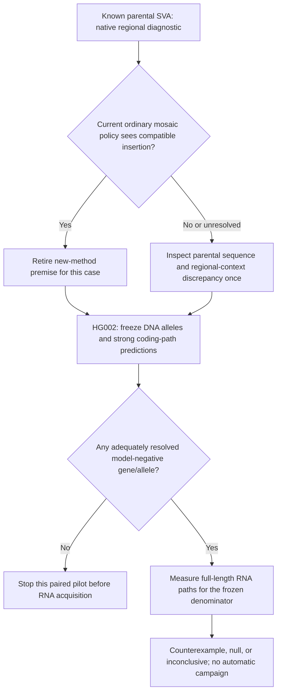

# Public paired-data falsifier: bounded scientific decision

Task date: 2026-10-09; completion crosses into 2026-10-10 in Asia/Tomsk. Requested GPT-6.1 Sol/max is a configuration request, not backend attestation. This note selects a diagnostic, not a publication direction. Main owns acquisition and execution.

## Decision

**YES: the four public paired lines can support one prospective exploratory test without a pre-identified failure. Select the parental SVA native diagnostic as the immediate measurement. Keep the HG002 paired test eligible as the next test of an unknown transcript residual.** These decisions have different purposes. The SVA test can quickly retire a specific method premise on a known, consequential case. The paired test asks whether an as-yet-unmeasured residual exists. Neither result, nor data availability, selects a publication campaign.

The scout's rejection of a new UDN318336 reanalysis remains correct. Its requirement for a previously identified public transcript-effect case does not apply to a frozen, prospective search for a counterexample across a DNA-defined denominator. Lack of demonstrated failure is not a reason to prohibit that measurement. One supported counterexample is enough for the stated assumption; a pilot need not have campaign-level donor replication or power.

Choose the family diagnostic first because it has a specific reported mechanism, a public same-parent input, and a current native control whose result changes the next action. This is more informative per unit of new processing than assembling a whole paired genome merely to learn whether any coding-path negative remains. The choice does not imply that mosaic calling is the stronger publication direction. Independent useful work may run in parallel; “first diagnostic” is not a serialization requirement.



## What the public paired material actually supports

The public pairs are HG001/GM12878, HG002/GM24385, HG02630 and GM20129. Reuse the scout's exact run mapping:

| Line | DNA run | RNA run |
|---|---|---|
| HG001 | SRR29438436 | SRR29438432 |
| HG002 | SRR29438434 | SRR29438430 |
| HG02630 | SRR29438433 | SRR29438429 |
| GM20129 | SRR29438435 | SRR29438431 |

These are same-sample bulk Fiber-seq DNA and MAS-Seq RNA, not linked DNA and RNA from each individual cell. The source uses pbsv, DeepVariant, HiPhase/trio-kmer phasing and hifiasm; RNA processing uses SMRT Link 12 and pbfusion 0.1. A transcript read can be a PCR duplicate. HG002 has reported 26x genomic coverage, 23,836 SVs at least 50 bp, and 3,716,982 transcript reads. These are assay/benchmark statistics, not a known coding-path failure. [Primary study, Results, Table 1 and Methods](https://pmc.ncbi.nlm.nih.gov/articles/PMC12077378/).

Main's completed full-field hub inspection finds FIRE/accessibility bigWig and bigBed declarations, with no BAM, RNA, VCF or FASTA declaration in those four manifests. This does not establish that processed sequence files are absent elsewhere. Do not assume an indexed sequence BAM exists at a FIRE-hub URL. The raw runs are the fallback; public smaller processed sequence products must be resolved by their own manifest before use. The old 3-Mb HG002 short-read pilot is not paired long-read material.

All four lines are exploratory development material. None is untreated validation, the UDN patient, or a substitute tissue. No expression-change, protein-function, NMD, disease-causation or prevalence claim follows from this pilot. Those limits do not prevent testing a sequence-level prediction.

## The paired question, frozen before RNA

Select **HG002** using DNA metadata: its source DNA has an applicable GIAB benchmark and strong phasing/assembly characterization. Do not choose among the four lines after viewing exon-SV identities, RNA junctions or expression. Do not switch lines if HG002 has no informative cases.

Test this explicit prioritization assumption:

> If all complete same-gene coding paths produced by a strong DNA-only annotation policy are disrupted on an observed structural allele, that allele can be removed from follow-up for complete coding transcripts in the sampled cells.

This is a proposed use of prediction, not a promise made by VEP or LiftOn. A VEP `HIGH` label alone does not assert loss of every coding isoform. “Complete coding path” means a start-to-stop ORF with the reference coding termini retained, allowing internal sequence changes. It does not mean the original protein sequence or function survives. A small downstream ORF is not rescue under this endpoint definition.

The frozen primary denominator is **every called non-reference DEL or INS of at least 50 bp intersecting a CDS in a protein-coding gene**, using all comprehensive reference transcripts. This narrower class avoids turning one pilot into fusion, inversion, regulatory and dosage campaigns. Record the other SV types separately as outside this primary model; do not silently treat them as successes. Retain filtered calls, uncertain phase/copy/sequence, affected coding termini and genes with no informative RNA as explicit unresolved or outside-endpoint-model rows. No disease-gene, high-expression, favorable-frame or literature-case selection is allowed.

Use the source same-sample VCF if an accessible, pinned processed product is established. Otherwise freeze one reproduction from those DNA reads with a declared pbsv version and settings; the original article does not establish the exact pbsv version. Do not call this reproduction the identical published callset. Freeze FASTA, comprehensive GTF/GFF, genotype/phase input, caller policy, allele sequence and event-to-gene rows with hashes. Calls missed by that DNA procedure are outside its ascertainment; this is not genome-wide transcript completeness.

Use one row per event/gene/alternate haplotype, and collapse linked events within the same gene/haplotype for the main count. Different transcripts, RNA segments and linked SVs are not independent biological replicates. The denominator is fixed before expression is known.

### Strong ordinary control and executable measurement

P0 is current VEP on the complete transcript catalog, with SV overlap/consequence information retained per transcript. P1 is a **fixed DNA-only LiftOn policy on both complete same-source haplotype assemblies**, with its ordinary DNA/protein alignment, ORF search and rescue defaults enabled. Keep all coding isoforms and candidate-copy placements. Check the actual allele and syntenic locus against same-source DNA reads. A failed lift, missing contig, uncertain extra copy, skipped locus or phase switch is UNKNOWN, not a model-negative prediction.

This control is materially stronger than a gene-overlap label or canonical-transcript-only annotation. Current VEP documents structural and breakend annotation and custom/haplotype assembly inputs. Liftoff offers CDS polishing and ORF status. LiftOn combines Liftoff and miniprot, changes coding boundaries and searches alternative reading frames. Its current inspected interface is v1.0.14, including isoform and second-locus rescue. Do not disable these features to manufacture a residual. [VEP native interface](https://jun2026.archive.ensembl.org/info/docs/tools/vep/script/vep_example.html), [Liftoff native interface](https://github.com/agshumate/Liftoff), [LiftOn primary algorithm](https://genome.cshlp.org/content/35/2/311.full), [current LiftOn manual](https://khchao.com/LiftOn/content/function_manual.html).

Pin GENCODE 50 comprehensive **primary-assembly** annotation with its matching GRCh38 primary FASTA, rather than the basic/canonical subset. Those matched public products are listed on the [GENCODE release page](https://www.gencodegenes.org/human/). Use whole-genome mapping and whole haplotype targets so paralogs and alternative placements remain possible competitors. A tiny exon crop is not the native control input. No parental genome is required merely to name haplotypes 1 and 2; maternal/paternal origin is not the estimand.

For each haplotype, the core native control is executable once main has verified the pinned runtime and material. Give concurrent runs different output/work directories:

```sh
lifton -g gencode.v50.primary_assembly.annotation.gff3 \
  -t 16 -polish -cds -copies --validate-output \
  -o h1/lifton.gff3 -dir h1/work \
  same_source.h1.fa GRCh38.primary_assembly.genome.fa

lifton -g gencode.v50.primary_assembly.annotation.gff3 \
  -t 16 -polish -cds -copies --validate-output \
  -o h2/lifton.gff3 -dir h2/work \
  same_source.h2.fa GRCh38.primary_assembly.genome.fa
```

Read mutation reports and the extracted coding sequences; a `frameshift` label alone is not the final ORF predicate. Preserve the run manifests and all skipped/unmapped loci. Apply the same declared translation exceptions to DNA and RNA, including selenocysteine; ordinary ATG/stop checks cannot adjudicate those exceptions.

If P1 has no adequately resolved model-negative row, stop at the DNA stage. Otherwise process the **complete RNA library** once, preserving whether archive records are concatenated or already segmented. Align globally with an Iso-Seq preset; phase informative RNA variants against the frozen same-source DNA phase blocks. Inspect the entire frozen cohort, including unexpressed genes. For every candidate RNA path, extract its coding sequence between the frozen, unaffected reference start/stop anchors. Read splice chains and sequence, not just isoform names. Obtain at least three supporting records from distinct original MAS arrays/ZMWs with consistent frame-changing sequence, complete endpoints and locus assignment. Require either two consistent transcribed phase markers or a marker plus diagnostic allele sequence/junction on the same DNA phase block. Unphased reference-looking RNA cannot rescue a heterozygous alternate allele. Homozygous alternate loci need DNA confirmation of copy state and unique placement.

The measurable output is finite: `D` frozen gene/allele rows; `N` resolved P1 model-negatives; counts with complete attributable RNA, partial/unattributable RNA and no informative RNA; and `K` reviewed complete-coding-path counterexamples to P1. Supply every row, coding sequence/hash, exon chain, phase proof and original array/read IDs. This is a one-sided presence test: absence of RNA does not prove transcript loss, and presence of an in-frame transcript does not prove functional rescue.

An RNA path already predicted by P1 retires the weak-label method premise for that row. A P0 error fixed by P1 supports use of that ordinary policy, not a new method. A P1 model-negative with a supported, alternate-allele, same-termini complete RNA path is a useful **within-assay counterexample**. Before treating it as a biological positive, review global alternative mappings, DNA allele identity, raw RNA sequence and template-switch/internal-priming signatures. Distinct ZMWs can still be PCR duplicates of one input cDNA; their count is a technical support screen, not molecule independence or a binomial sample size. A retained candidate can justify one independent transcript check. It does not justify immediate training or a broad biological claim.

Stop with an inconclusive outcome if phase, copy structure, artifact status or expression prevents adjudication. Stop this pilot with a null result if no counterexample survives. A null is specific to this denominator and assay depth. If a counterexample survives, the next action is to explain and independently check that exact coding-path discrepancy against P1; only then compare potential contributions. No new method is selected now.

## Immediate selected assay: parental SVA native diagnostic

The competing case is concrete: the Platinum study reports a 3,407-bp SVA in NA12887's maternal haplotype, around 11% parental NA12878 read support, and absence on the grandparental transmitting haplotype. It already establishes the family mechanism. Its native validation uses assemblies and parental reads. [Primary de novo SV Results and Methods](https://doi.org/10.1038/s41586-025-08922-2).

Use the original **blood-source NA12878 CHM13 HiFi BAM**, not the separately listed NA12878 cell-line Revio technical GRCh38 material. Main has verified the public object's BAM size 203,640,216,494 B, BAI size 37,783,472 B, byte-range support, and a 65,536-B prefix with `SM:NA12878`, chr3 length 201,105,948, and a pbmm2 CHM13 v2.0 masked-Y/rCRS reference record. No alignment record was parsed in that prefix check. Charge all 65,536 B, including bytes beyond the textual header.

Main's direct workbook read supplies the row `chr3-71589910-INS-3407` with coordinates 71,589,909 and 71,593,317. There is no inserted sequence column or stated coordinate convention. **The 3,408-bp coordinate difference is not an established reference deletion/span for this insertion.** The child sequence and whole-family calls are controlled. A same-length insertion at this location is not exact child-allele truth. The workbook is 249,138 B with SHA256 `34279cdd3bf16e250ea25edde1e2d1e5d26e7deb0ca140a24558acebb67b413f`; this is source evidence, not an acquired child genome.

The immediate estimand is therefore **visibility of a sequence-supported parental insertion compatible with the published SVA neighborhood under current native regional policies**. It is not an exact-child-allele sensitivity estimate, a full trio reanalysis, or a new inheritance discovery. Keep the parental inserted sequence and its unique flanks so that exact identity can later be tested if source truth becomes available. Do not use a truth-selected forced-genotyping VCF as discovery input.

Freeze one buffer BED, `chr3\t71539909\t71643317`, and one reporting/core BED, `chr3\t71579909\t71603317`, before reads are examined. These are deliberate BED half-open query windows around the whole uncertain reported neighborhood; they do not assign a coordinate convention to the workbook event. Retain complete alignment records, original read names, CIGAR/SA/RG/HP tags and source sequence. Fetch any required same-molecule supplementary records if they affect the local insertion reconstruction. The buffer reduces boundary clipping; it does not prove that all whole-genome processing is equivalent.

Use Sniffles2 2.8.1 at source commit `684c7cb2f2f1d0a6dfe794617c661b1b7018c8c3`. Run its **native germline and native mosaic policies** on the same indexed regional BAM and core BED. The minimum-support parser default is actually 3. Leave that default and each mode's merge and other QC defaults intact. In particular, do not replace native 0.22/0.27 merging with an invented common 0.23 primary control. The strongest relevant ordinary success control is the intended mosaic policy. Germline-only absence cannot establish a defect in that policy. [Pinned native-input/source review, including completed fifth-file addendum](/Users/akm/aayushkrm-AlignSSL/repo/docs/research/2026-10-10-sniffles-sva-native-input-check.md), [official native mode interface](https://github.com/fritzsedlazeck/Sniffles/blob/684c7cb2f2f1d0a6dfe794617c661b1b7018c8c3/README.md).

The completed source check makes the expected behavior explicit: native germline mode filters VAF at or below 0.218 as `MOSAIC_VAF` for this insertion path; native mosaic mode admits its 0.05–0.218 AF range with its own support/QC rules. This is designed mode behavior. It already weakens any publication premise based only on germline miss plus mosaic success. The empirical diagnostic is selected to check actual parental signal and ordinary-policy sufficiency on this material, not to discover that the software has a mosaic mode. It is not required to establish that documented capability, and success must not be presented as a new defect, method or inheritance discovery.

```sh
sniffles --input NA12878.CHM13.regional.bam --regions core.bed \
  --vcf parent.germline.vcf --threads 4 --output-rnames

sniffles --input NA12878.CHM13.regional.bam --regions core.bed \
  --vcf parent.mosaic.vcf --threads 4 --output-rnames --mosaic
```

These are the actual small follow-up commands, not runs completed here. Run the two arms in parallel with the independent read/allele census when material and runtime are ready. Whole CHM13 FASTA is optional for BAM/INS calling; do not acquire it solely to execute these arms. The completed source follow-up shows that `coverage()` returns the provider-array mean, while the default constant support floor does not use that mean. Only opt-in `auto` support blends 75% local and 25% global coverage; do not enable it. The provider-array extent and whole-genome equivalence remain unverified, but neither is a reason to prohibit this native regional diagnostic. Record local coverage, native support/filters and the regional-input limit. No further generic source-audit round is commissioned.

Main reports no installed Sniffles runtime, available base CPython 3.12.1, a Graal Python 3.10.8 environment and a separate Truvari Python 3.10.20. Do not assume Graal provides the required CPython extension runtime or that a version label alone establishes dependency compatibility. A pinned isolated CPython installation, dependency/import checks and indexed-input open are routine implementation work for main. They are not another scientific permission gate. This note installs nothing and attests no working runtime.

Separately count **original alternate and reference spanning reads** under frozen flank and mapping criteria. Preserve support sequences and alignment ambiguity. Do not compare the published approximate 11% directly to emitted insertion VAF: Sniffles rescales insertion support and emits `SUPPORT_UNSCALED`; its native VAF is not a raw alternate/read ratio. Record sequence ALT, anchor, `GT`, `FILTER`, scaled/unscaled support, VAF and read names separately. Mode differences include merging, support QC and genotype filtering; this is a comparison of whole native policies, not attribution to one AF switch.

| Observation | Decision changed by that result |
|---|---|
| Germline has a compatible supported insertion | This known case does not motivate rescuing a missed germline call. Retire that case premise. Distinguish emitted candidate from non-reference genotype. |
| Germline misses/rejects it; native mosaic supports it | Germline-only absence fails as an exclusion rule in this regional diagnostic. An existing intended policy handles the signal; retire a new-method premise for this case. |
| Both miss/reject it despite credible local insertion reads | Retain a bounded native-context/representation discrepancy. Inspect it once against the raw parental sequence, actual local coverage and native filter reasons; do not assert an exact-allele failure or start training. |
| No credible compatible parent insertion, or unresolved mapping/sequence | INCONCLUSIVE about the published event. Record the sample/material/truth dependence. Do not erase the paper's result. |

Success tests ordinary sufficiency at the observed parental locus. A miss is useful diagnostic evidence but cannot establish missed transmission of the exact child allele without that allele's sequence. Neither outcome establishes prevalence or a whole-genome caller ceiling. If this case is resolved by the ordinary policy, move to the frozen HG002 DNA-stage test rather than expanding a known-case mosaic caller grid.

## Material, cost and execution bounds

All figures below distinguish available source context, existing acquisition and future bounds. They are not measurements of a launched experiment or transfers of an old HG008 allowance.

| Work | Actual context and a finite useful bound |
|---|---|
| Family diagnostic: already observed | Remote BAM 203,640,216,494 B; BAI 37,783,472 B. Main has acquired a 65,536-B prefix. No index, regional read packet or caller result yet. The 249,138-B workbook is separate source material. |
| Family diagnostic: selected next packet | New genomic transfer bound **4 GiB**, including BAI, BGZF overfetch/retries and supplementary recovery; **16 GiB** peak workspace/RAM envelope; **1,800 CPU seconds** total native calls and census. Log actual network bytes, retained bytes, CPU and wall time. These are generous diagnostic bounds, not expected read-packet sizes. No whole BAM or whole reference acquisition. Exceeding a useful-context bound gives a scoped INCONCLUSIVE result, not an automatic full-genome job. |
| Paired HG002: currently available pointer, not local material | The scout's archive-file range is 31–47 decimal GB per DNA run and 1.6–4.3 GB per RNA run. It does not give the exact HG002 byte total in this decision. Main will supply the actual selected object representation and byte lengths; do not label these ranges measured downloads. Source DNA yield is 80.34 Gb of bases, which is not compressed-file bytes. |
| Paired HG002: justified whole-context pilot envelope | At most **60 GiB** new archive transfer for the selected pair, plus **10 GiB** matched reference/annotation/runtime material; **512 GiB** peak disk, **256 GiB** peak RAM and **600 CPU hours** total for conversion, whole-genome alignment/phasing, same-source diploid assembly, both ordinary annotation runs, RNA processing and analysis. These are planning ceilings, not observed runtimes or a claim that every stage needs the maximum. If fresh GPU small-variant calling is necessary, allow at most **8 GPU hours**, charged separately. No training. No full parent genomes are assumed free. |

The paired disk bound includes archive staging, decompression/conversion, genomic and RNA alignments/indices, phased derivatives, about 6 Gb of diploid assembly sequence, annotation intermediates and temporary files. Smaller processed products can reduce the real total only after their provenance/representation is verified. A 65.4-GiB free local disk is not a valid workspace for this fallback. Use cluster storage for that pilot; the old arbitrary tiny crop or two-hour cap would not supply native useful context.

Use all useful parallel resources. For the family packet, two four-thread calls plus the census are useful; padding a small locus to 128/256 busy cores is not. For the paired pilot, genome alignment and assembly can run concurrently, then the two haplotype controls can run concurrently with separate directories and measured memory allocations. RNA processing can follow the frozen DNA decision without exposing outcomes beforehand. Parallelize independent per-locus analysis after the denominator and policies are fixed. Scale thread counts to actual throughput/RAM, not empty-queue status. Use a GPU only for a required native GPU stage. No source-reading task creates a biological experiment or a booked job.

## Prior art and claim boundary

The synchronized multi-ome article already phases DNA and RNA and resolves a clinical fusion and several mechanisms with additional assays. Reproducing those findings, or showing that full-length RNA adds information, is occupied ground. The 2021 haplotype-resolved genome study already links SVs to expression and splicing QTLs; this pilot is not an eQTL/sQTL contribution. [Ebert et al., complete QTL Results inspected](https://pmc.ncbi.nlm.nih.gov/articles/PMC8026704/).

LiftOn is the closest directly inspected ordinary coding-path reconstruction control. Its published protein/ORF reconstruction is not the same experiment as a frozen same-source SV denominator tested against phased full-length RNA, but the existence of that control substantially narrows what a useful residual must be. This bounded source set does **not** establish that no prior study has conducted the proposed audit. The scout's recurrent-astrocytoma lead remains a novelty warning: its accessible discovery abstract describes DNA–RNA–ORF integration, but a canonical full primary body was not established here. Do not infer feature absence or originality from that unread body. [Abstract-only discovery record](https://exa.ai/library/publication/1b9wf2qvb69).

Thus the paired experiment is justified by its value for choosing the next research action, not an asserted empty literature niche. A surviving discrepancy might be known annotation incompleteness, a routine ordinary-policy fix, an assay artifact or a consequential new failure mechanism. Determining which is the point of the finite assay. It can legitimately end with no paper.

## Audit and handoff

Fully read the governing objective, the completed after-M1 investment review, the structural-transcript scout, the family scout and the completed Sniffles native-input note. Independently read complete PMC12077378 Results/Table 1, Methods and data paragraphs; selected complete LiftOn algorithm Results/Methods; Ebert QTL Results; and Platinum de novo SV Results, relevant material/calling Methods and data statement. Current native documents were read for VEP, Liftoff, LiftOn, pbsv, pbfusion, Sniffles and GENCODE. The LiftOn abstract-only first fetch was superseded by the primary body for the selected sections. These are selected source reads, not an exhaustive review.

Firecrawl was used under its skill and the complete relevant paper/developer reference instructions. Exactly **two** new targeted discovery searches were made, each returning eight excerpts; those results did not establish novelty. Additional retrievals were known primary/native URLs, not an expanded search. The PMC metadata skill was inspected but not used for metadata execution. Scite's reported access denial was not retried or bypassed. Main's current asset, workbook, prefix and cluster checks are explicitly attributed to main; no source download or caller execution is inferred from them.

This agent acquired no genomic data, installed no tool, launched no job, accessed no credentials, changed no billing, and performed no Git operation. Only this new owned note was written with apply_patch. The main task's committed source snapshot `9c7aa93f86370107ec811b2bf16efa263ae02518` is user-supplied provenance, not a Git action or independent backend attestation here. Old HG008 fixed16/32 closures and costs remain intact; they are not biological nulls.

**Handoff: execute the bounded parental native-policy diagnostic with compatibility/truth limits; do not invest in a new mosaic method from a germline-only miss. The public paired HG002 DNA-first coding-path pilot is scientifically eligible without a pre-proved residual. Its frozen RNA presence test is the concrete next unknown-residual measurement, with the full native-context cost above. No publication campaign, new method or major positive result is accepted by this note.**
