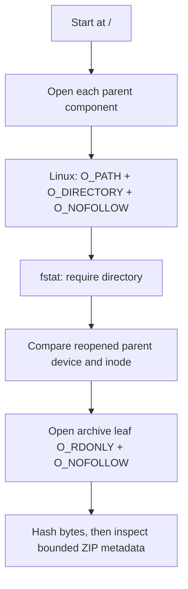

# SVUPP ancestor permission failure: diagnosis

**Scope:** static diagnosis and a minimal correction design. This note does not
change source or tests. It does not approve another run.

## Finding

`analysis/inspect_pinned_research_zip.py::_open_parent_without_symlinks` opens
the root and each parent component with
`O_RDONLY | O_DIRECTORY | O_NOFOLLOW`. It opens components one at a time with
`dir_fd`, so `O_NOFOLLOW` applies to every component. The helper then checks
that each descriptor is a directory. It saves the final parent's
`(st_dev, st_ino)` and compares that identity after reopening the parent.

The reported Slurm 1604210 control run failed at
`os.open('beegfs', ...)` with `PermissionError: [Errno 13]`. The report is
**16 failed, 12 passed in 5.36 seconds**; the real archive acquisition had not
started. This is consistent with the helper asking for read access to an
ancestor directory when it only needs a directory reference for traversal,
`fstat`, and later `dir_fd` operations. Linux `O_PATH` opens that reference
without read permission on the directory itself. It still requires execute
(search) permission on directories used to reach the target. See the Linux
[`open(2)` documentation](https://man7.org/linux/man-pages/man2/open.2.html#O_PATH).

The `EACCES` report does not identify the exact denied permission bit or ACL.
No `stat` or `access` check was made for `/beegfs` or `/beegfs/scratch` as part
of this diagnosis. A missing search permission on a path prefix would still
deny traversal. The logged error is not evidence of a symlink or a malformed
ZIP. In this code, the parent open occurs before the source file is statted or
opened, and before any ZIP record is parsed. The helper also wraps `OSError`
as `ValueError("a path parent is missing, unsafe, or a symlink")`; that broad
message can mislabel a permission failure. The chained exception is the useful
cause.



## Minimal correction design

In `_open_parent_without_symlinks`, select only the directory descriptor's
access flag by platform:

```python
if sys.platform.startswith("linux") and hasattr(os, "O_PATH"):
    access_flag = os.O_PATH
else:
    access_flag = os.O_RDONLY
flags = access_flag | os.O_DIRECTORY | os.O_NOFOLLOW
flags |= getattr(os, "O_CLOEXEC", 0)
```

Use these same flags for the anchor and every component. Keep the existing
`O_NOFOLLOW` and `O_DIRECTORY` capability checks, descriptor closing, and
post-open `fstat` directory checks. Keep `_directory_identity` and
`_assert_parent_unchanged` unchanged. Linux permits an `O_PATH` descriptor to
be used by `fstat` and as the `dir_fd` for `openat` and related `*at` calls.
The immediate directory-type check also rejects a descriptor that refers to a
symlink instead of a directory.

Keep the existing `O_RDONLY` directory-open behavior on non-Linux platforms.
That is the portability fallback; it may still require read permission on
directories. Keep failing closed when `O_NOFOLLOW` or `O_DIRECTORY` is not
available. Do not change the archive leaf open: it needs `O_RDONLY` to hash
the stored bytes. This design removes the unnecessary read requirement from
Linux parent descriptors. It does not bypass search permission, grant file
access, or change archive parsing.

## Focused controls for a later implementation

Keep the current symlink-parent rejection control
(`tests/test_pinned_research_zip.py::test_symlink_parent_is_rejected`) and
the linked-source controls. Add only these permission cases:

| Case | Setup | Expected result |
| --- | --- | --- |
| Search without directory read | Linux parent has write and execute permission, but no read permission; known source file is readable | Inspection reaches and reads the file; manifest creation succeeds |
| No search on an intermediate parent | Remove execute/search permission from an intermediate directory that contains the next path component | Traversal fails closed; no archive read or manifest is produced |
| Parent symlink | Existing symlink-parent fixture | Inspection rejects the path |

Run the denial case as an unprivileged user. A privileged test process can
bypass ordinary mode-bit checks and give a false pass. These are proposed
controls only; no test was run or added in this diagnosis.

## Attempt disposition and evidence limits

Job 1604210 is **closed incomplete**. Retain its full 512 MiB charge and count
the measured 2.64 CPU seconds once. It produced no scientific null. This
diagnosis grants no new run, acquisition, booking, or budget. At dispatch the
exact raw-record path
`results/data_audits/svupp_inventory/2026-10-09/raw01` was absent. It appeared
in the checkout while this note was being prepared. I saw its untracked path
in `git status` but did not open its contents; this note does not attest them.
No cluster wrapper, archive contents, or key contents were read. No full test
suite was run.
