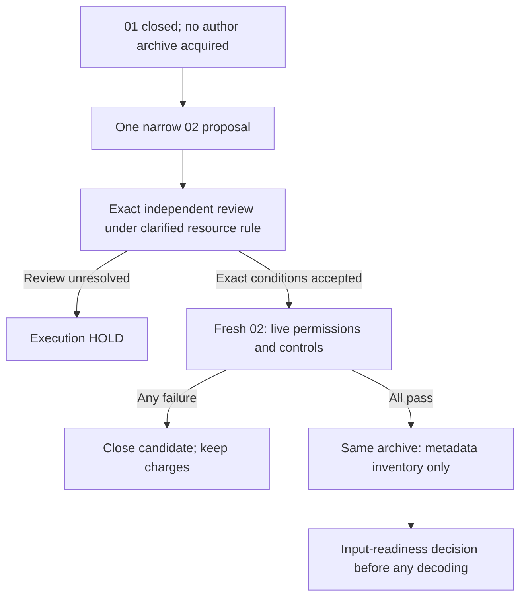

# SVUPP permission-value decision: one prospective 02, execution HOLD

2026-10-09. Requested decision configuration: GPT-6.1 Sol / max effort.
The actual backend model and effort are not independently attested.
The newest objective was read in full before this decision was saved.
This assignment writes only this file. It does not approve or perform a job.

## Decision

**Select ONE separate corrected inventory 02 for prospective exact review.**
Its scientific purpose is to establish whether the same small author archive
can support the already selected confidence-value falsifier. This limited
investment is worth considering despite weak current publication potential.
It can prevent investment in a confidence model with little useful scope.
It does not select a paper, a model, or a general filesystem research project.

**Execution remains HOLD for fresh exact independent review.** The user has
resolved the new resource clause: "Use all useful resources efficiently;
scale parallel experiments fully." The complete corrected proposal still
needs review. No 02 allowance is booked, root created, or job approved by
this note. Inventory 01 remains ACCEPT CLOSED INCOMPLETE, with its consumed
claim and full charge retained. A separate 02 must never resume that root.

This is an explicit, single prospective exception to the earlier rule that
a resource/setup failure closes this candidate. It covers only the identified
Linux directory-open compatibility issue before acquisition. It does not
remove the prohibition on archive-format or author-parser repair. If the
correction needs wider production changes, or 02 fails, close this candidate.
There is no automatic 03, alternative archive, or further repair slot.

## Evidence and policy boundary

The [result01 note](2026-10-09-svupp-inventory-result01.md) and the completed
[actual-result review](2026-10-09-svupp-inventory-review.md) establish the stop.
Slurm 1604210 failed before the real payload claim and acquisition. The actual
28 controls reported 16 failures, 12 passes, zero skips, and 5.36 seconds.
Every failed traceback names ancestor `beegfs`, errno 13, at component-wise
`O_RDONLY | O_DIRECTORY | O_NOFOLLOW` opening. No author ZIP, central
directory, member content, score, truth join, or genotype outcome was read.

The reviewer checked all 12 payload hashes and all 13 archived files.
Payload 76,846 bytes plus checksum 1,011 bytes equals 77,857 bytes. The closure
is ACCEPT CLOSED INCOMPLETE. Its acceptance approves no replacement. The
result note's earlier verification-pending wording is a preserved snapshot;
the later review completes that local verification. This decision did not
repeat the raw-file audit. Main reports all original bytes tracked and pushed,
most recently with review/diagnosis/raw in 372ebd4; no Git check was made here.

I read the full completed [permission diagnosis](2026-10-09-svupp-ancestor-permission-diagnosis.md).
That worker performed a static check, without actual ancestor `stat` or ACL
inspection. Main subsequently reports this live metadata at 13:20:03+07:

| Main-reported object | Observed mode |
|---|---|
| `/beegfs` | `0711`, `drwx--x--x` |
| `/beegfs/scratch` | `0755` |
| Owned physical workspace | `0700` |

Main also reports an empty queue. These are supplied observations, not cluster
checks by this decision. Mode 0711 supports the read-versus-search explanation:
the group/other mode classes have search permission but no directory-read
permission. It is not a complete proof of effective access; identity, ACLs,
and live descriptor operations still matter. No corrected real inventory has
run. Errno 13 supplies no evidence of corrupt ZIPs or missing data.

The reviewer also found that an existing symlink-parent control could pass
by matching the earlier generic ancestor exception. Thus the 12 passes do
not establish that every intended guard was reached. New controls must prove
the intended permission and symlink branches, not only produce a pass count.

The [completed value decision](2026-10-09-post-native-value-decision.md)
says to close the pilot after a resource/integrity failure and to avoid a
parser/preparation research loop. Those rules are binding historical
dispositions, not evidence that the scientific hypothesis is false. This
note explicitly proposes one narrow amendment for a failure before acquisition,
with no changed scientific input or endpoint. Integrity and archive-format
failures still stop use of the input. Original code, logs, reservations,
charges, and closed roots stay preserved.

## Scientific value, with the prior-art limit intact

The useful question remains whether fixed SVUPP/kanpig genotype outputs
leave material room for confidence selection at neighboring SVs under
ONT ultra-long to HiFi transfer. The [scientific reconciliation](2026-10-09-post-native-value-review.md)
sets the development target at 1% released-label discordance and a coverage
margin of 10 percentage points in neighboring SVs over strong ordinary
controls. These are investment thresholds. They are not biological accuracy
guarantees.

The prospective benefit is additional reliable structural-dosage information
at loci that would otherwise be excluded. That could matter for genotype use
in research. No clinical benefit or significant new method is established.
A small ceiling can reject further model investment. A large ceiling merely
leaves room; it does not establish learnable signal, correct truth, or novelty.

Generic GQ ranking, matched coverage, neighbor-stratified discordance, and
ordinary recalibration are already occupied. The full
[kanpig prior-art note](2026-10-09-kanpig-calibration-prior-art.md) further
documents native v2 beta-binomial fitting and GQ calibration. Its raw top-two
likelihood ratio is not posterior genotype-error probability. Parameter
refitting can change GTs and falls outside selection on fixed outputs.
Archived caller versions and score meanings remain unverified. A gap on old
outputs cannot establish improvement over the current native baseline.

The investment case therefore rests on a finite rejection test, not expected
paper success or earlier spending. The asset identity and the falsifier are
already fixed. No outcomes from this archive have been seen. A directory access
correction can expose that first readiness decision without changing labels,
alleles, target technology, thresholds, or archive parsing. There is no need
to repair an author format to answer it. If readiness cannot be established
within the remaining envelope, stop this route even though its hypothesis
remains untested. Operational policy is not scientific falsification.

Require complete scored GTs for both fixed callers, exact published truth GTs,
catalogue/reference and ALT identity, callable eligibility, sample provenance,
technology/depth, and the fields needed for native/support controls. Require
the specified ONT ultra-long/HiFi pair. Code, aggregate curves, or plausible
filenames alone do not qualify. Missing or unresolved labels and no-calls
remain visible. A technical replicate of NA12878 is not a new donor/family.

If a later, separately reviewed content protocol establishes those inputs,
retain the same eligible units and neighbor definition, all frozen native and
ordinary controls, source-only fitting, and grouped locus/family/technology
splits. For each caller, the fixed-output ceiling remains
`(K + min(W, floor(K/99))) / N`. Compare the maximum of the two separate
caller ceilings with the strongest nonempty qualifying frozen control.
Never assemble a per-locus cross-caller genotype oracle. Zero accepted calls
have undefined discordance. Uncertainty crossing the 10-point boundary closes
the pilot INCONCLUSIVE; it gives no extension or endpoint change. The earlier
Brier/80%-coverage/30-error proposal is not an added gate for this ceiling.

Any eventual contribution needs a useful residual beyond current native and
ordinary controls, a specific method, and independent structural truth and
donor/locus validation. This archive is development evidence. Inventory
success and filesystem compatibility are infrastructure only. Neither meets
the full objective of meaningful, publication-worthy research. DeepSV stays
excluded as a foundation; SSL has no preferred status. The stopped generic
released-callset route and closed native attempts remain stopped; H_R is
UNTESTED.

## Permitted shape of the prospective correction

Only the following narrow production changes belong in a prospective 02 proposal:

1. On Linux, use `O_PATH` for the anchor and each ancestor directory
   descriptor in `_open_parent_without_symlinks`. Preserve `O_NOFOLLOW`,
   `O_DIRECTORY`, `O_CLOEXEC` where available, component-wise `dir_fd` use,
   directory `fstat` checks, descriptor closing, and the existing reopened
   parent device/inode identity check. Keep non-Linux directory access
   `O_RDONLY`. The production Linux stack must support the reviewed flags;
   missing support stops the proposal rather than weakening containment.
2. Keep the archive leaf `O_RDONLY | O_NOFOLLOW`. Preserve regular-file and
   single-link requirements, snapshots, source/name identity checks, both
   complete stored hashes, and exclusive output checks. `O_PATH` supplies
   a directory reference; it neither grants archive read access nor bypasses
   search permission. It is not a general concurrent-writer safety proof.
3. Pin only the new ID `svupp-inventory-20261009-02`, under
   `/beegfs/scratch/ws/ws1/igorno-alignssl_restart_20260922/`.
   Update its exact literal root, claims, tests, wrappers, reservation, and
   dependent pins. Do not introduce selectable roots or reopen 01. Preserve
   the exact failed source snapshot and original archived bytes.

Retain the [inventory protocol](2026-10-09-svupp-inventory-protocol.md)
scope: one acquisition of `SVUPP_paper.zip` from record 17569072, exactly
47,443,427 bytes, publisher MD5 `5469337ca9249691b2b376ceb9b67e1d`.
Retain streamed/stored digest agreement, complete central-directory listing,
all ZIP/type/link/path/integrity guards, and all existing numerical caps.
Member bodies must remain undecoded. Full stored hash passes read opaque ZIP
bytes; listing does not validate member CRC or decompression integrity.
No bundled code, caller, raw-read acquisition, alternative asset, parser
format repair, or partial scoring belongs in this correction.

## Resource addendum and exact independent review

The governing new objective adds:

> make sure to utlize full available resources on cluster when starting any computing cluster job.

It also retains efficient resource use and cheap diagnostics. The user has
now supplied the controlling interpretation:

> Use all useful resources efficiently; scale parallel experiments fully.

This explicit clarification resolves the earlier pending question. A serial
directory/hash/metadata inventory can use one CPU efficiently under this
interpretation. Extra idle CPUs or GPUs add no useful comparison to this job.
Keep the one-CPU, bounded-memory design as the prospective resource choice;
the exact reviewer must inspect its actual wrapper, limits, CPU account, and
submission. The old acceptance remains historical and approves no new job.

Scale useful parallel experiments fully when such experiments are selected
and their scope and account are approved. This inventory contains one asset
and one readiness action. The clarification adds no parallel attempt, caller,
dataset, resource allowance, or campaign. Do not duplicate work to occupy
resources. If the complete corrected inventory cannot fit its unchanged
allowance, close this candidate as a resource-policy stop.

A fresh independent Sol6.1/high-requested reviewer must inspect the complete
02 source diff, tests, wrappers, exact literal submission, all bundle hashes,
reservation/account, both objective snapshots, this decision, the completed
diagnosis, actual 01 closure, and the user's resource clarification. Requested
reviewer configuration is not backend attestation. The old 01 conditional
ACCEPT and closure ACCEPT cannot approve changed source, a new root, or the
new resource configuration.

The exact review must establish these finite conditions:

1. The production diff changes only Linux directory access and the separate
   02 identity/pins. Archive-format behavior, scientific inputs, and guards
   are unchanged. Any wider necessary repair ends this candidate.
2. Preserve all 28 original control intents. Add focused Linux controls for
   a readable file behind a searchable but unreadable parent; denial at an
   intermediate parent without search; and denial of an unreadable archive
   leaf. Verify symlink-parent rejection reaches its intended branch, and
   retain identity/mutation/link controls. Run permission cases unprivileged,
   with effective permissions checked; privileges or ACLs must not mask the
   negative case. Freeze the expanded exact count. Require all cases to pass,
   with zero skips, before any real download.
3. Before download, require fresh live permission metadata and successful
   reviewed `O_PATH` traversal/`fstat`/`dir_fd` controls on the actual physical
   workspace. Check effective identity/access and absence of a fresh 02
   root/claims at the proper precreation step. The 13:20:03 mode snapshot is
   supporting evidence, not a future runtime pass. No production chmod, ACL,
   ownership, elevated privilege, dependency installation, or alternate-path
   workaround. Synthetic permission fixtures stay within the capped control tree.
4. Approve the resolved resource allocation and complete named pass account
   within 512 MiB/180 seconds. Preserve the prior one-CPU, 2 GiB address-space,
   120-second outer wall plus five-second kill grace, 60/90-second per-process
   CPU, file, control-tree, log, and output limits. The clarified instruction
   requires no larger allocation for this serial check. No guard or scope
   enlargement follows from it.
5. Require booking before root creation/staging, refreshed booked pins, one
   exclusive submission claim and one payload claim, and one exact submission.
   Unknown acknowledgement consumes the slot. Actual-stack controls and
   post-control source verification precede acquisition. Failure stops 02.
6. Require complete metadata-only collection within the existing 2 MiB cap,
   source/local hashes, full logs/timer/claims, successful wrapper exit and
   completion marker for success. Preserve partial evidence on failure.
   Independently review actual results before accepting inventory readiness.

Review may condition acceptance on the already specified booking-status and
timestamp repin. It must name the final conditions. Changed code, allocation,
scope, or command needs review of that actual change. No current 02 exact
acceptance or corrected actual-stack pass is claimed here.

## Unchanged finite account

| Charge or allowance | Value |
|---|---:|
| Retained bytes after closed 01 | 41,309,049,739 bytes |
| Measured named CPU after closed 01 | 563.932707 seconds |
| Remaining whole-candidate maxima before 02 | 1,610,612,736 bytes / 420 allowance seconds |
| Proposed 02 subset, UNBOOKED | 536,870,912 bytes / 180 allowance seconds |
| Retained total if 02 is booked | 41,845,920,651 bytes |
| Residual whole-candidate maxima after 02 | 1,073,741,824 bytes / 240 allowance seconds |
| Original complete candidate envelope | 2,147,483,648 bytes / 600 allowance seconds |
| Retained total if the entire original byte envelope is allocated | 42,919,662,475 bytes |

Attempt 01 retains its 512 MiB charge and its 180-second allocation. Proposed
02 allocates another 512 MiB/180 from the same envelope. Together they
allocate 1 GiB/360; 1 GiB/240 remains. These are allocation limits, not observed
bytes or CPU. They neither refund 01 nor add another 2 GiB/600 candidate.
The global 64 GiB/7,200-second ceilings remain unchanged. No budget is
increased or booked in this note.

The accepted 01 outer CPU was 1.10+1.54=2.64 seconds, already included once in
563.932707. Do not add it again, add pytest wall time, or count Slurm CPU
as a second charge. After any 02, add only its measured outer waited-tree
user+system CPU once. 563.932707+180=743.932707 is a prospective allowance
comparison, not a measured total. The 420 future allowance seconds consist
of proposed 02's 180 plus residual 240; the failed 01's unused time is not reused.

The earlier named byte-pass ceiling was 373,017,001: 47,443,427 acquisition,
94,886,854 stored hashes, 201,326,592 synthetic passes, 12,582,912 metadata
passes, and 16,777,216 staged code/log/claim allowance. The exact 02 review must
confirm its focused controls and metadata still fit. This is a named account,
not a complete measurement of filesystem/network/cache I/O. Retain the full
new 512 MiB charge even if 02 fails before acquisition. The residual 1 GiB/240
approves no content or scoring job; a complete future analysis must fit it.

## Finite next action and terminal outcomes

Main's next in-scope action is to prepare ONE reviewable 02 candidate with the
specified access-flag correction, focused controls, exact new ID, account,
and metadata-only scope under the resolved resource interpretation. This
decision task implements none of it. Obtain exact independent acceptance
before any booking, root creation/staging, submission, or download. If the
correction or complete inventory requires wider work, stop this candidate.

| Subsequent observation | Required disposition |
|---|---|
| Exact corrected proposal review pending | Execution HOLD; no new job. |
| 02 control, acquisition, format, integrity, timeout, or resource failure | Close this candidate incomplete, preserve full charges and evidence; no 03. No scientific null or data-absence claim. |
| Complete metadata conclusively shows no qualifying resource | Close this archive path INPUTS INSUFFICIENT. No other asset or repair loop. |
| Plausible members or opaque containers leave content unresolved | Scientific readiness HOLD. At most a separately pinned complete content protocol within residual 1 GiB/240; names alone do not approve decoding or scoring. |
| Complete content cannot establish the fixed caller/truth/technology pair, or cannot fit | Close INPUTS INSUFFICIENT or resource-incomplete, as applicable. No substitute caller, platform, favorable prefix, or larger budget. |
| Later bounded comparison finds insufficient ceiling or sufficient ordinary controls | Reject confidence-model investment on those fixed outputs under the stated labels. |
| Later comparison finds a robust material gap | A separate method/value decision and independent truth/novelty review only. No positive method, clinical, training, or publication claim. |

The scientific selection is conditional 02; the current execution state is
HOLD. The objective remains unmet. The only achieved result here is this
bounded investment decision.

## Read scope and provenance

Read FULL the initial objective and newest objective; completed post-native
value decision and full scientific reconciliation; kanpig prior-art note;
inventory protocol, full review including the actual 01 closure append,
result01 including the collection update; completed 101-line permission
diagnosis; and October 8 strategy-reset decision. Read PROGRESS lines 1–140
and RESTART_STATE lines 1–155, then their newer closure openings. Their full
historical bodies were not read. Inspected only the relevant parent/identity
source and launcher/root passages; no complete new code audit is claimed.
The newest objective and the user's explicit resource clarification govern.
The initial objective remains a read snapshot. The resource question was
pending during the first draft; the user's answer supersedes that state.

| Read input | Observed SHA256 |
|---|---|
| Initial objective, attachment 46e156a6 | `624de4ace478d0476cc8d899197c61db22a32c55543edb61f79ac7e9bd4145a0` |
| Governing objective, attachment 1c5d7b81 | `cdce4c9e320ce1550efeb230e4a4af90930f9eb953531d41459f34b428cb9b12` |
| Completed post-native value decision | `878b7490e63736969555c234366b915d92ec1d33938ab1d48696219e8e00ec89` |
| Scientific reconciliation | `27ad9cd428609aa774db7dc581dde2bc4a1e3b995de3f30ab486eb723f252158` |
| Kanpig prior-art note | `500f2ac5c8b4fe46217da4fbe93ddc534fb37594edb5fd8faa1318bf3ec2be12` |
| Completed permission diagnosis | `e7160b630bb518a7cbb53ac4b4c8eea47a5c31cd6ce150e309eca60795b13507` |
| Inventory review including actual 01 closure | `ae6f9c8a47883780a8845cd1d53eb5c0dae62032c5c3736debe52b009f6d2d6b` |

Latest cluster-mode and Git preservation facts are main/user reports with the
limits stated above. Prior-art facts reuse the local reports and their source
inspection limits; no fresh paper or network check occurred. No original raw
artifact, author archive, genomic data, or outcome was read by this decision.
Only this requested file was written. No source/other-file edit, test or
bundled-code execution, cluster command, booking, job, installation, network,
Git operation, or message to another chat occurred in this task.
