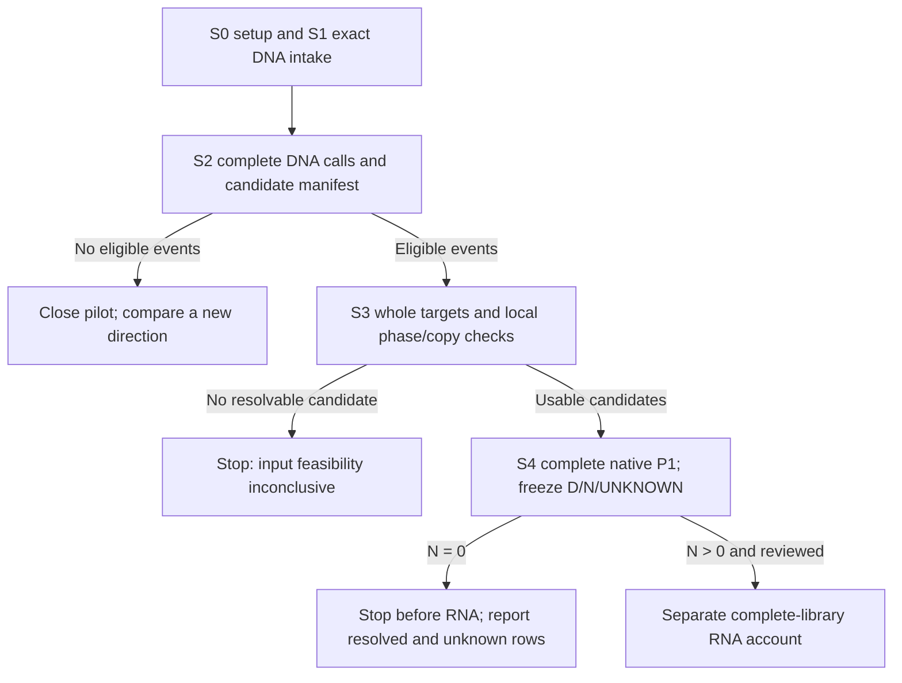

# HG002 DNA-stage investment decision

2026-10-10, Asia/Tomsk. Decision only; main owns execution and tracking. The maintained reviewer reviews concrete stages in parallel. This note does not attest an installed runtime or book a job.

Requested decision configuration: GPT-6.1 Sol/max. Backend identity and effort
are not independently attested; the model setting is a request, not measured
scientific evidence.

Select **B: one exact-source DNA intake, followed by separate release gates for calling, native haplotype reconstruction and P1**. Recommend routine setup and the bounded intake now. Release each whole-genome stage only when its input packet and concrete recipe pass independent review. The previous 600-CPU-hour envelope remains unapproved; RNA has no allocation here.

The [accepted actual SVA review](2026-10-10-public-paired-falsifier-review.md) closes the parental caller-method premise. Keep it closed. The [frozen paired decision](2026-10-09-public-paired-falsifier-decision.md) still governs HG002. The next scientific result is whether that fixed DNA policy leaves any adequately resolved negatives, N; it is not a new method or a publication claim.

| Option | Scientific value and risk | Decision |
|---|---|---|
| A: qualify/use the two public split assembly BAMs | About 2.14 GB could avoid reconstruction. But source read inputs, original contig retention, splitting and unmapped sequence retention are unproved. Missing sequence or competing copies can create false P1 negatives. | Do not use them as the primary control or acquire them merely to repeat the header check. An already available generation manifest plus demonstrably complete sequence recovery could replace reconstruction after review. |
| B: exact study DNA, native reconstruction and P1 | Preserves the chosen source and permits a prospective policy audit. Costs are real before N is known. Native assembly can leave switches, collapsed copies or unresolved loci. | Select one staged attempt. Keep full genomic context and mark unresolved gene/haplotype rows UNKNOWN. |
| C: stop/pivot now | Saves all new DNA processing; avoids buying an uncertain publication premise. It also leaves this accepted, accessible falsifier unmeasured. | Reserve as the exit when a stage cannot deliver its useful output within its account, or the completed DNA test leaves no resolved negatives. Do not switch donors to seek a positive. |

DNA spending buys a research decision, not the counterexample itself. If P1 resolves every eligible row as positive, this particular exclusion-rule test has no negative rows to challenge. If N > 0, a separately budgeted RNA presence test becomes eligible. If all potential negatives remain UNKNOWN, the material is insufficient for this pilot. Those are useful closures, but none is automatically a paper.

There is no defensible numerical probability of N > 0 or of publication from the present evidence. Novelty is also unresolved: ordinary annotation incompleteness, existing rescue behavior and assay artifacts can explain a later discrepancy. One bounded DNA attempt is justified by the concrete decision it can settle. Repeated assembly/annotation tuning or larger acquisition to protect the direction is not justified. A pre-proved failure, RNA inspection or parental genomes are not prerequisites.

The [main input recipe](2026-10-10-hg002-dna-input-recipe.md) establishes a direct preprint link and ENA SRR29438434 alias for `HG002_WGS.haplotagged.bam`. The BAM is 48,727,325,910 B; its BAI is 21,582,928 B. Together they are about 45.40 GiB. These are remote object lengths, not completed transfers. Multipart ETags are not full-file MD5s.

The retained DNA header has Revio CCS provenance, 195 GRCh38-like sequences, no SQ M5 and no haplotagging PG. No alignment record has yet been checked. Thus source linkage is materially stronger than the filename, but usable HP/PS, full read sequence and reference base identity remain untested. The lowercase assembly headers have generic `UnnamedSample` and pbmm2 1.4.0 with split-FASTA input names. Same donor, directory or genotype concordance cannot prove the same source read input. The finite listing's lack of FASTA does not prove global absence.

Use the study BAM first. The ENA FASTQ is 33,155,968,933 B with main-pinned MD5 `6005ab626a327f082337a66bb9704465`; it is an alternative representation, not a free second download or an established phase-preserving substitute. Its `subreads` name alone does not prove read type or base equivalence. A representation change needs a specific defect and a revised acquisition account.

The following are **prospective spending limits**, not measured runtimes or a guarantee of completion. CPU hours mean allocated CPUs times elapsed hours, summed across tasks and failed attempts; also report measured CPU separately. Limits do not reset on retry. Only S0/S1 are recommended for immediate release; S2–S4 are conditional accounts, not one blanket booking.

| Stage and useful output | Transfer / aggregate CPU limit | RAM / peak disk limit | Release or stop condition |
|---|---|---|---|
| S0: pinned tools, matched reference and executable endpoint controls | 4 GiB reference/software; 4 CPU h | 16 / 32 GiB | Routine isolated setup. Pin versions, dependencies and actual interfaces; retain failures. No scientific permission gate for each install. |
| S1: one verified DNA object, complete read extraction and readiness report | 52 GiB cumulative HG002 genomic body reads; 8 CPU h | 16 / 160 GiB | Exact BAM/BAI only. Include existing prefix charge, overfetch and retries. Integrity/sequence failure stops reconstruction; absent HP/PS alone does not. |
| S2: complete genomic alignment/calls and CDS-overlap manifest | No second DNA library; 96 CPU h | 64 / 384 GiB | Reviewer accepts the exact caller/reference/phase recipe after S1. If there are no called eligible events, close the pilot before assembly. Unresolved events stay visible. |
| S3: one native HiFi-only reconstruction and local allele/phase/copy qualification | No parents/Hi-C; 256 CPU h | 192 / 384 GiB | Reviewer accepts the pinned assembly mode and read input. Preserve both unabridged native target sets and competing sequence. If no candidate can be resolved locally, stop before P1. |
| S4: both complete-target P1 runs, coding-path states and frozen D/N/UNKNOWN report | No RNA; 96 CPU h across both arms and adjudication | 128 / 384 GiB | Endpoint controls pass; required native paths/isoforms are accountable. Run both arms once with separate directories; unresolved rows cannot become negatives. |

These conditional stage maxima sum to 460 allocated CPU h for DNA and setup. They are not permission to consume 460 h without the intervening results. The 52-GiB DNA limit and 4-GiB reference/software limit are separate. Neither draws from closed historical accounts. Main must show projected and actual storage, including raw custody copies, expanded reference, compressed reads, alignments, graphs and temporary files.

Across concurrent stages, reserve at most 256 GiB RAM and 512 GiB total disk, including retained material. These are working limits, not a feasibility attestation. Do not add per-stage disk maxima as independent free allowances. Reduce concurrency if summed peaks do not fit. A stage that reaches a limit preserves its output/checkpoint and stops; a specific revised account needs review against option C. Never recover budget by cropping the target, dropping difficult genes or weakening the endpoint.

S0 includes GENCODE 50 matched primary FASTA, comprehensive GFF/GTF, translations and selenocysteine metadata: 1,152,186,383 compressed bytes in the pinned recipe. Verify published checksums after acquisition. LiftOn is v1.0.14 at commit `8378f8e4a3d8404c94d801c285a2c74291e893b7`; check that installed behavior matches the frozen policy. These acquisitions and normal dependency/import/help checks are routine implementation, not a whole-genome experiment.

Begin S1 with one finite record-level check of the exact BAM, using at most 256 MiB of the S1 body allowance including BAI and overfetch. Check original CCS names, sequence/quality, clipping and actual HP/PS fields. This is an input check, not another metadata inventory or a genome-wide phase certificate. Continue to the single full-object transfer if records support usable extraction. Hash the complete object and extracted read set; count unique original reads/bases, unmapped reads and lost or conflicting sequence. Compare with the archive's reported 5,359,077 spots/80,344,827,828 bases, explaining representation differences rather than assuming equality.

Extract one complete source read per original identity, with correct orientation, and retain unmapped reads. Secondary/supplementary records do not create new molecules. Detect hard-clipped or absent sequence that cannot be restored; do not manufacture complete reads from incomplete records. The source header's `--unmapped` command is supporting provenance, not proof that the complete object retains every required read. Avoid a plain uncompressed FASTQ if compressed input suffices within the declared native recipe.

For S2, declare one pbsv reproduction if no pinned same-source VCF is established; do not claim identity to the published callset. Establish reference base compatibility before reusing source alignments. Names/lengths and REF spot checks alone cannot certify the old reference; otherwise remap all source reads to the matched reference within S2. Include any required small-variant calling/phasing in its concrete budget. No automatic GPU stage is included. Preserve the complete called DEL/INS >= 50 bp CDS-overlap manifest, all comprehensive transcripts, filters and unresolved records. Final alternate-haplotype assignment and linked-event grouping must be frozen before RNA.

For S3, main's current native README check reports that HiFi-only hifiasm since v0.15 produces `bp.hap?.p_ctg.gfa` **partially phased** targets with switch errors; native purging can misassemble. This is source evidence attributed to main, not an installed-version or assembly attestation. Pin the actual build and settings before launch. `--h1`/`--h2` are Hi-C inputs, not switches for source HP read sets. A primary/alternate pair is not two complete haplotypes by renaming it.

Here, complete targets mean the unabridged native whole-genome contig sets, with their limitations recorded. They do not mean telomere-to-telomere sequence or chromosome-wide phase certainty. Retain graphs, read assignments, alternate/unplaced sequence and competing copy placements. Do not select only mapped split contigs. For each tested gene/allele, use same-source read/variant support to connect the SV, coding sequence and relevant phase block to its local target. Detect gaps, switches, collapse/purging ambiguity and copy uncertainty; these make that row UNKNOWN. HP without a validated block, or an h1/h2 filename, is insufficient.

Local haplotype labels suffice; maternal/paternal names are unnecessary. Do not acquire parents or RNA just to assign them. Nor must every chromosome be fully phased before any row is usable. Whole-genome context must remain available to compete with the local placement. A path in an uncertain extra copy cannot silently rescue or exclude the affected syntenic allele. Homozygous alternate rows require confirmed copy state and placement, not fabricated heterozygous phase.

S4 retains the fixed native LiftOn DNA/protein alignment, ORF search, rescue, isoform and copy behavior on both whole targets. Account for all eligible reference coding isoforms and retained projected/rescued paths. A missing lift, successful GFF validation or frameshift label is not a resolved negative. Freeze the extractor's strand, CDS phase, reference start/stop anchors, terminal-stop convention and translation exceptions; test complete reference and ordinary DNA-positive paths. A downstream ORF or lost reference terminus does not satisfy the same-termini endpoint.

The resolved-negative predicate requires supported local allele sequence/phase/copy, applicable reference termini, complete policy accounting and no retained native path meeting that endpoint. It tests this fixed policy as an exclusion rule; LiftOn does not exhaust all biologically possible splice paths. Keep event/gene/alternate-haplotype rows and collapse linked events for the main count. Retain UNKNOWN and outside-endpoint rows rather than hiding them in N.

N = 0 closes this pilot at DNA; distinguish all-resolved positives from unresolved potential negatives. N > 0 is necessary, but RNA still needs the frozen adjudication rules and its own reviewed execution account. No expression-based gene choice or donor switch is allowed. The later endpoint remains attributable, reference-termini-complete RNA paths with the required original-array support and DNA-block linkage. No informative RNA is not transcript loss; K = 0 with no observable rows is inconclusive. A surviving K is a within-assay candidate pending artifact review and the specified independent check, not proof of SV causation, functional rescue or novelty.

Use useful parallelism: S0 and intake can overlap; S2/S3 can overlap after their review gates and a nonempty candidate manifest, if summed resources fit. The two P1 arms can run together after reconstruction/qualification. Scale threads to measured throughput. Do not reserve idle whole nodes or GPUs. Preserve scratch outputs through writable login-side archive I/O before scratch expiry; do not run expensive analysis on login.

Latest main-reported setup state supersedes an assumption of writable compute-node home: jobs 1604238/1604239 failed before pip; actual mkdir errors confirm project home is read-only on both hydra-n12 and hydra-n1. The separate batch-signal cause is unproved. Main is preparing frozen wheels and a scratch venv, then login-side archives/offline home installation using normal I/O. Completion is not attested here. Qualify the actual scratch work path on each execution node; neither these path failures nor the unproved signal establish a global cluster block. Charge the failed setup attempts in S0; no installed environment or zero CPU cost is inferred from failure before pip.

Read scope: FULL governing objective attachment, 2026-10-09 paired decision, complete 2026-10-10 review including accepted SVA result, parental result, main DNA recipe and cohort implementation note; also the three existing off-Git header summaries. Latest hifiasm/setup facts above are user/main reports. No new literature, genomic acquisition, installation, job, cluster connection or Git operation occurred here. Only this new investment note was written. Main continues input tests/tracking; maintained review proceeds in parallel. The governing publication objective remains unmet.
