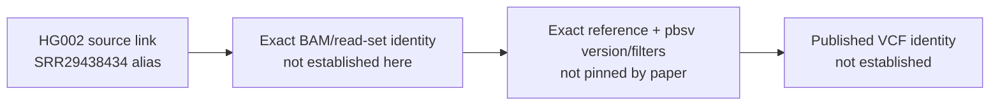

# HG002 published SV-call provenance

2026-10-10. Sidecar for S2. This records what the two paper versions pin and what they leave open. It does not change the frozen DNA-first choice or release a call run.

Sources: [Nature Genetics article, DOI 10.1038/s41588-024-02067-0 (PMC12077378)](https://pmc.ncbi.nlm.nih.gov/articles/PMC12077378/) and [bioRxiv v1, DOI 10.1101/2023.09.26.559521](https://www.biorxiv.org/content/10.1101/2023.09.26.559521v1.full).

## Recipe fields

| Field | Paper record | Provenance limit |
|---|---|---|
| SV caller | Both versions name `pbsv` for SV calling. | Neither inspected main-text page gives a pbsv release/commit, exact command, or caller-native filter thresholds. “Default” is not stated. |
| Alignment reference | The article names the GRCh38 v4.2.1 benchmark in its HG002 benchmarking context. | That benchmark citation does not identify the FASTA used to align the source BAM. The preprint/article do not pin its edition or digest. |
| Aligner | The paper pages do not pin an aligner version or exact alignment command. | The processed BAM header records `pbmm2 1.10.0` and the reference filename `hg38.analysisSet.fa`; it also records an `--unmapped` command. This is artifact-header evidence, not a published FASTA checksum. The header has no `M5`, so sequence identity cannot be inferred from names and lengths. See the [bounded input/header record](2026-10-10-hg002-dna-input-recipe.md). |
| Phasing | The final article names HiPhase v1.2.1; the v1 preprint names HiPhase without a version. | The methods do not establish an `HP`/`PS` tag-generation command or a genome-wide tag contract. In the already-read 65,536-byte BAM prefix, three records from two original CCS reads show `HP=1` and `PS=1`; all three are supplementary. This proves those observed fields only, not complete-library phase identity. |
| Published data pointer | The v1 data statement links [`HG002_WGS.haplotagged.bam`](https://stergachis-manuscript-data.s3.us-west-1.amazonaws.com/2023/Vollger_et_al_long-read_multi-ome/HG002_WGS.haplotagged.bam). The article links the [HG002 PacBio track-hub descriptor](https://s3-us-west-1.amazonaws.com/stergachis-manuscript-data/2023/Vollger_et_al_long-read_multi-ome/HG002_pacbiome/trackHub/hub.txt). | The BAM is a source input, not a VCF. The article URL is a hub descriptor, not a direct, versioned SV VCF. The existing [paired-data decision](2026-10-09-public-paired-falsifier-decision.md) reports no VCF declaration in its four inspected hub manifests; this bounded check does not prove that no other public VCF exists. |

The paper links the processed DNA artifact to HG002. The existing archive record maps its submitter alias to run SRR29438434. That supports study/library provenance; it does not by itself verify full BAM bytes, complete read-set equivalence, or a published callset hash.

One `pbsv` run on the study BAM is therefore a **reproduction attempt**, not a reproduction of a validated published callset. Exact library bytes and call identity are separate checks. Call identity would need a pinned input/reference and caller recipe plus a directly identified published VCF and an output comparison. None is supplied by the two inspected paper pages. Do not import current pbsv defaults to fill these gaps.

This leaves the existing S2 condition intact: if no pinned, same-source VCF is established, declare one pbsv reproduction with its actual version, reference, filters and phase inputs; do not label it the identical published callset. See the [staged S2 decision](2026-10-10-hg002-dna-stage-investment.md).

## Source coverage

Three targeted Firecrawl page retrievals: one PMC article page and two fetches of the same bioRxiv v1 full-text page, with the latter used for a focused field extraction. Coverage used here is the variant-identification Methods and Data availability text. No discovery search, supplementary-file fetch, VCF fetch, or technical-document retrieval was made. The hub-manifest statement above comes from the existing input record, not a new page fetch. This sidecar did not inspect job 1604284 or read genomic bodies.
