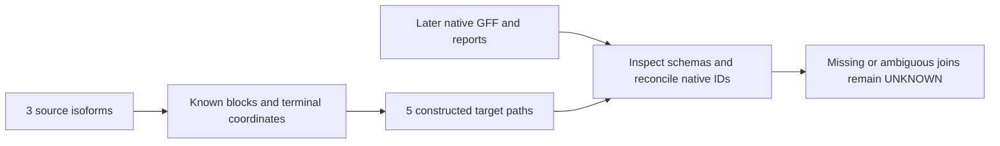

# Synthetic LiftOn interface fixture v1

2026-10-10. Implementation sidecar for main's later native interface run. Inputs are generated solely from seeded random bases and codons. No donor sequence, genome input, RNA, external download, installation, cluster job, or native LiftOn run was used here. The published-calling note was not edited. Requested Luna/max is not an independently measured backend/effort identity.

Writer: [analysis/make_lifton_interface_fixture.py](../../analysis/make_lifton_interface_fixture.py). Tests: [tests/test_make_lifton_interface_fixture.py](../../tests/test_make_lifton_interface_fixture.py).

| Constructed content | Reference | Target |
|---|---|---|
| Complete FASTA set | Two 4,000-base contigs; 8,000 bases | Three 4,000-base contigs; 12,000 bases |
| Plus-strand gene `SYNTHG0001.1` | `SYNTHT0001.1` and `SYNTHT0002.1`; distinct internal exons, shared terminal exons | Both isoforms at `target_plus` and at the additional `target_extra` copy |
| Minus-strand gene `SYNTHG0002.1` | `SYNTHT0003.1` | One complete copy at `target_minus` |
| Coding paths | Three 453-base CDS chains; three exons each, every block phase 0 and length divisible by 3 | Five known compatible paths, all preserved in ground truth |
| Termini/translation | ATG start, TAA included terminal stop; 150 amino acids without internal stops | Explicit source-to-target CDS and codon-coordinate maps |

The gene loci retain their full 1,800-base synthetic sequence, including introns and flanks, after relocation. Background outside these islands is independently generated and unrelated. Introns have strand-correct GT/AG splice sites. Isoforms of the same gene share sequence by design; the other gene has an independently generated protein. There are no designed negative paths or translation exceptions. This simple fixture does not test partial CDSs, junction-spanning terminal codons, phase 1/2, recoding, or complex rescue.

Version `lifton-interface-v1`, seed `20261010`, and versioned source IDs are fixed; the CLI has no seed or sequence override. The tests pin the manifest SHA256 `684b56f9b566e4eb3d100fdd0f07785a7acc09c9bfb354d60a9d1ff70a7c4867`. Intentional content changes need a new fixture version and reviewed IDs. The two FASTA files total 20,312 bytes, below 30,000 bytes.

Create a fresh input directory under an existing parent:

```sh
python -B -m analysis.make_lifton_interface_fixture --output-dir /absolute/existing-parent/fresh-fixture
```

The writer resolves paths, rejects symlink leaves/ancestors and every existing destination (including empty directories), then claims the new directory exclusively. Files are written to exclusive staging files and published with atomic file renames; `manifest.json` is last. A failed publication can leave partial input artifacts without a manifest. Preserve that directory and use a new destination; retries cannot overwrite it. The manifest hashes every other output; it does not hash itself.

| File | Role |
|---|---|
| `reference.fa`, `target.fa` | The complete tiny native inputs; no locus crops needed |
| `reference.gff3` | Native input hierarchy: gene → mRNA → exon/CDS; protein-coding biotypes, exact `ID`/`Parent`, gene/transcript attributes, strand and phase |
| `expected_target.gff3` | Construction truth for all target copies; **not** a native input or claimed native output |
| `truth.json` | Every source isoform, coding DNA/protein and hashes, ordered reference/target blocks, and oriented start/stop codon positions |
| `expected_crosswalk.tsv` | Source gene/transcript × known target copy/location; fixture target IDs are explicitly separate from native IDs |
| `manifest.json` | Version, seed, file byte sizes and SHA256 hashes; identical across destination paths |

For main's later pinned native run, use `reference.gff3`, `target.fa`, and `reference.fa` with the existing `-polish -cds -copies --validate-output` policy. Omit `-P/-T` so native generated FASTA names/headers can be observed. Give `-o` and `-dir` separate resolved paths in a fresh run directory. Record actual argv, tool versions and rescue/copy environment overrides.



Main must inventory/hash the actual GFF3, intermediate generated FASTAs and their headers, score.txt, stats files, run manifest and any rescue/copy records under the actual `-dir`. Inspect the literal score/stat columns and every emitted gene/transcript/copy ID. Join each source isoform and all emitted placements to this explicit coordinate truth; do not assume serialized ref IDs or strip copy suffixes. Native ranking may select either plus-gene copy first. The fixture copy labels C0/C1 and `FIXTURE.*` IDs do not predict native suffixes.

The fixed native policy has filters and a default cap of one additional second-locus placement per gene. This input supplies one additional copy, but it cannot guarantee native retention of both copies or all isoforms. Missing or dropped paths require accounting and remain UNKNOWN; a failed positive fixture is not a biological negative. This writer does not parse native outputs or implement the final P1 classifier.

Terminal coordinate correspondence is known here because the loci were constructed and relocated explicitly. Coding-sequence identity alone does not establish homologous reference termini in real targets. Passing this fixture qualifies only the observed ordinary native interface and its joins; it does not certify whole-genome biology, exhaustive copy/path search, S4 readiness or any negative.

Read scope: the complete [pinned path-interface note](2026-10-10-lifton-path-interface.md), the review's initial conditions and its complete [finite LiftOn findings](2026-10-10-public-paired-falsifier-review.md#lifton-path-interface-sidecar-finite-independent-findings). No new source search or plugin fetch was needed. The review's caps, missing-join UNKNOWN rule, and terminal-mapping limits govern this fixture handoff.

Validation: existing `/Users/akm/aayushkrm-AlignSSL/.venv/bin/python`, standard-library writer, pytest tests; Bio is absent and no package was installed. The synthetic tests independently translate the full standard genetic code, reconstruct both orientations, check GFF hierarchy/phases/termini, verify all IDs/copies and coordinate crosswalks, pin deterministic hashes, and exercise existing-output refusal and interrupted publication.

Executed from the repository root:

```sh
PYTHONDONTWRITEBYTECODE=1 /Users/akm/aayushkrm-AlignSSL/.venv/bin/python -B -m pytest -q -p no:cacheprovider tests/test_make_lifton_interface_fixture.py
```

Final result: **12 passed in 0.30s**. Fixtures were created only in pytest temporary directories. No persistent fixture output, native execution, final classifier, or genomic qualification was added; only the three owned source/test/note files were written.

## Main execution handoff

Main fully reads the writer/tests/note and reproduces12controls,0.52s.
The combined local finite selection passes165tests+9subtests,2.77s,
zero skips. Frozen writer SHA256
`fb0c6423a1ba19235103d58debca65f921aef355e1ddff0f0a506a0fa09a94e7`,
tests `92ee8481d5cd164ed4b8e5c446f066239774445c738b774a0ea0640a649ef0b8`.
[Native synthetic script](../../scripts/check_lifton_synthetic_interface.sh)
SHA256 `3f34f85e0368cc94ed449f468fc47d231d5c0612cf65cef27703e3ce06868535`.
All three uploads complete before the remote digest/new-leaf checks.
Job1604293 books1CPU/2GiB/5minutes, no GPU, inside S0. It checks the entire
preserved aligner artifact manifest, runs12Linux fixture controls, verifies
the generated immutable fixture manifest, and invokes the pinned native
LiftOn with separate resolved output/work paths. Shell-local PATH includes
the isolated native aligners and existing LiftOn runtime; no shared edit.
It records only relevant `LIFTON_*` environment overrides, command argv,
versions and all raw outputs. Full-source1604284 remains untouched.
The booking is not an interface pass or endpoint result. Main owns actual
artifact/schema/ID reconciliation and custody before interpreting this run.

Actual1604293 COMPLETED0:0,5allocatedCPU seconds/2.237measuredCPU,
105332K stepMaxRSS;12Linuxcontrols pass0.42s. Native emits3genes/5mRNAs/
15CDSs/15exons and validates GFF without errors, **but this is not a full
interface pass**. Stderr reports miniprot's alignment timing and a nonempty
GFF with the five constructed transcript placements. LiftOn then catches
`[Errno121] Remote I/O error` and stages a Liftoff-only partial result.
Its run manifest records `partial_success`, one pipeline failure, zero
processed miniprot candidates and null miniprot returncode. The generic
`launch_error`/`process did not start` label conflicts with the actual
miniprot stderr/GFF; do not infer a launch-only failure or a captured exit0.
Cause is not yet established. No rescued-path or full-native qualification.
All artifacts are preserved in matching non-expiring home; the original
regular-file hash list passes there. Main will add a separate complete
custody inventory for late hash-check/exit files without changing raw files.
Maintained reviewer independently accepts the fixture and flags exit0,
PATH binding and final-manifest limits in the retained review.

Main's login-side comparison of SHA256 lists for **all** regular files in
scratch versus home matches, including the late hash-check/exit files.
The full packet remains there unchanged. Local recursive SCP follows pytest
symlinks and encounters dangling-link copy errors; main stops only its own
verified transport process and preserves that partial local copy. A separate
tar stream transfers all primary inputs/reports/logs, excluding only disposable
pytest tmp files, to the off-Git `runs/lifton-interface-20261010-01-primary`.
That is not a complete original-manifest local copy. Six finding-bearing raw
synthetic files are copied unchanged to `results/lifton_interface_s0_20261010_01`;
all six source/destination hashes match. No genomic object enters Git.
The exact historical shell script is also archived in Git with its original
SHA2563f34f85e0368cc94ed449f468fc47d231d5c0612cf65cef27703e3ce06868535.

## Finite I/O diagnostic 02 (not a full-native pass)

Main prepares one new exclusive output/bundle02 under the same1CPU/2GiB/
5minute S0 cap. Inputs and rescue/copy policy are unchanged. Native aligners
are first in shell-local PATH; their actual resolved paths/hashes are recorded.
`LIFTON_MINIPROT_THREADS=1` and `--serial-aligners` control tiny-run resources;
the01 command left miniprot's -t absent, so a one-thread assumption was unsafe.
An observation-only [trace entry point](../../analysis/trace_lifton_io.py)
logs the exact stack for native errno121 without suppressing/retrying errors
or changing native data/decisions. Its three local controls pass; with the
fixture,15pass0.38s. No source package patch or global environment edit.
The diagnostic can locate a reproduced failure; a non-recurrence would not
establish its original cause. Frozen02 script SHA256
`4e60c8f25986af42a813a851044d36b1f0cf6e10b8ed8c84ab40946d7ebbd7f2`,
trace source `e25216e1a5b50be96b601d90c991a300125f72e0072681181c1c1c3bf72618a5`.
Both uploads complete before remote hash/new-leaf preflight and dispatch.
Original01 artifacts and failures remain intact. Whole-genome P1 remains
unreleased regardless of this diagnostic's exit status.

Actual02 job1604294 COMPLETED0:0,5allocatedCPU seconds/2.584measuredCPU,
100896K stepMaxRSS. All12Linux fixture controls and regular artifact hashes
pass. Native records `run.status=success`, zero pipeline failures, captured
miniprot returncode0 and successful miniprot database creation. No errno121
is logged; original cause remains unproved. Actual resolved-tool paths bind
to the preserved02 aligner binaries; the only recorded native override is
`LIFTON_MINIPROT_THREADS=1`. Whole raw output is copied unchanged to matching
home, and the original regular-file manifest verifies. Local primary copy
excludes only pytest tmp artifacts as in01. Maintained review of actual02
positive paths/interfaces is pending; no endpoint/rescue-only/genomic
qualification follows from these statuses. Main's full local finite suite
now passes168tests+9subtests,2.48s, zero skips.
