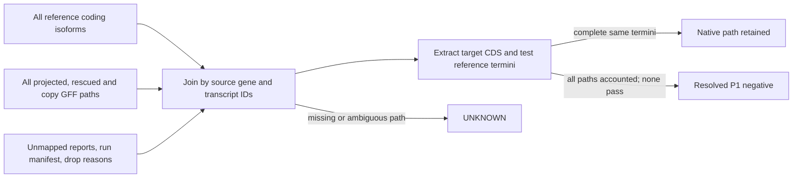

# LiftOn native path interface: bounded extractor contract

Date: 2026-10-10. This note fixes the input and output contract for the HG002 DNA-stage P1 extractor. It is a static source audit, not a LiftOn genome run or an endpoint result.

## Frozen endpoint

P1 is the ordinary, whole-genome LiftOn policy on each complete same-source haplotype target, with copy search and the native rescue/isoform defaults on. Use the pinned call from the DNA-stage decision: `-polish -cds -copies --validate-output`, matched GENCODE 50 primary-assembly GFF3 and GRCh38 primary FASTA, and separate output/work directories. Keep all reference coding isoforms and all target placements. Do not restrict to canonical transcripts or one copy.

The endpoint is retention of the **reference coding start and stop termini on a complete path**. A downstream ORF with a new start does not rescue a lost reference start. A `frameshift`/mutation label, protein identity, mapped gene, or successful GFF validation does not decide this endpoint.

## Pinned interface and files

The installed runtime is reported as LiftOn 1.0.14 from commit `8378f8e4a3d8404c94d801c285a2c74291e893b7`. Setup records report CLI/version/help, dependency checks, and Python imports passed. They do not attest minimap2/miniprot execution or a P1 run. The source audit below is static evidence from that exact commit.

| Artifact | Native contract | Extractor use |
|---|---|---|
| `-o lifton.gff3` | Main GFF3. Includes target gene/transcript/exon/CDS rows and attributes. | Parse all rows, not only the top-ranked transcript. Keep `ID`, `Parent`, `source`, type, coordinates, strand, phase, and every attribute. |
| `lifton_output/intermediate_files/` | When `-P`/`-T` reference protein/transcript FASTAs are not supplied, `extract_features_to_fasta` creates `generated_proteins` and `generated_trans` there. | Retain and hash these files. Exact filenames and FASTA header schema are not established by the inspected files. |
| `lifton_output/score.txt` | Native score/status report. Rescue writes to this file too. | Preserve raw file and hash. Its column schema is not established by the inspected source. |
| `lifton_output/stats/unmapped_features.txt` | Unmapped-feature report. | Join by exact source ID where possible; absence from this file is not proof of a retained path. |
| `lifton_output/stats/extra_copy_features.txt` | Extra-copy report. | Preserve every row and placement. |
| `lifton_output/stats/mapped_feature.txt`, `mapped_transcript.txt`, `completeness_by_feature_type.txt` | Always-written summary reports. | Preserve as diagnostics; do not use summaries as the isoform denominator. |
| `lifton_output/run_manifest.json` | Run argv/options, inputs, backend/tool commands, counts, validations, failures and phases. | Bind each result to the exact haplotype inputs and run. This is not a per-transcript completeness certificate. |

There is no separate mutation-report filename established in the inspected source. Mutation/status and identity are carried in GFF3 attributes; score output also exists, but its fields need a pinned schema check. Successful miniprot rescue, isoform rescue and second-locus rescue are written into the main GFF3 and score output. Preserve tags including `lifton_rescue`, `rescue_isoform`, `lifton_rescue_second_locus`, `rescue_gate`, `miniprot_protein_coverage`, `status`, `mutation`, `protein_identity`, `dna_identity`, and copy attributes when present.

The native CLI accepts the target FASTA, reference FASTA, reference GFF3/GTF, and optional reference protein/transcript FASTAs (`-P`, `-T`). Keep the full input files and their hashes. For this GENCODE policy, use the comprehensive GFF3, not the basic or canonical subset.

## Parser and row schema

Parse reference GFF3 by `ID`/`Parent`; enumerate every protein-coding transcript with CDS rows. Keep the reference gene ID, transcript ID, transcript/gene biotype, sequence, strand, ordered exon/CDS blocks, each CDS phase, `start_codon`/`stop_codon` rows when present, genetic-code attributes, and `transl_except`. Retain any protein-coding transcript row without an extractable CDS as `UNKNOWN`, not as an omitted isoform. For GTF input, LiftOn transforms `transcript_id` to a suffixed internal ID; do not mix that namespace with native GFF3 IDs without a recorded mapping.

Parse target GFF3 into one row per reference transcript × emitted target transcript placement. Preserve target `ID`/`Parent` separately from source `ref_gene_id`/`ref_tran_id`; preserve copy number/suffix and placement coordinates. LiftOn keeps source IDs in its model and builds forward/reverse transcript-ID maps, but this audit did not establish that those maps are serialized. Capture the crosswalk at run time or verify it in `mapped_transcript.txt`; never infer identity from coordinate proximity alone.

Each extracted row must contain:

```text
run_id, input_hashes, haplotype_id, event_id, allele_sequence_hash,
allele_phase_id, local_copy_state, local_placement_state,
ref_gene_id, ref_transcript_id, ref_biotype, ref_seqid, ref_strand,
ref_exon_chain, ref_CDS_blocks_and_phases, ref_start_anchor, ref_stop_anchor,
genetic_code, transl_except, target_gene_id, target_transcript_id,
target_seqid, target_strand, target_exon_chain, target_CDS_blocks_and_phases,
path_origin, copy_id, rescue_tags, status, mutation, dna_identity,
protein_identity, target_CDS_sequence_hash, translated_sequence_hash,
target_start_anchor, target_start_codon, target_stop_anchor, target_stop_codon,
terminal_mapping_status, terminal_mapping_evidence, start_anchor_retained,
stop_anchor_retained, complete_same_termini, internal_stop,
path_accounting_state, source_artifact
```

`path_origin` distinguishes projected, miniprot-only rescue, rescued isoform, second-locus rescue, and extra-copy placement. `path_accounting_state` is `emitted`, `explicitly_dropped` (with a joinable source ID and reason), or `UNKNOWN`. Keep one explicit accounting row for every reference coding transcript, even when LiftOn emitted no target row. Then aggregate to the frozen event/gene/alternate-haplotype denominator. A resolved P1 negative requires supported local allele/phase/copy, every reference coding isoform accounted for, every retained native placement examined, and no complete path retaining both reference termini.

The diagram shows the intended join. A missing join stays `UNKNOWN`.



## Phase, ORF and stop handling

LiftOn's `coding.py` defines transcript-oriented phase helpers, reverse-strand handling, genetic-code selection, translation, and `transl_except` placement. Its translation drops a trailing partial codon. It treats ATG as the start in its standard start check and gets stop codons from the selected genetic code. Apply phase once at the transcript's initial incomplete codon; retain and check phase on every later CDS block. Do not trim each exon independently. Read the target sequence from the target FASTA in transcript orientation; record stop-codon presence from DNA, not protein identity.

The pinned README describes ORF search over alternative frames to maximize match to the reference protein. It also documents default miniprot stop completion when the three genomic stop bases exist and do not worsen the model. These transformations can change a path's boundary. They do not change the frozen endpoint: a newly chosen downstream start is not the reference start. The exact lower-level ORF transformation implementation was outside this six-file source audit; preserve the native output and classify any unverified terminal mapping as `UNKNOWN`.

The runtime extractor must map each reference start/stop anchor onto the specific target path. LiftOn's IDs, protein identity, and mutation labels alone do not provide that proof. If no unambiguous path-level mapping is available, do not call the path complete or disrupted. Use the same declared genetic-code and recoding rules for DNA and any later RNA analysis.

## Completeness boundary and finite open items

`drop_ledger.py` records defined loss classes by feature ID and reason, and reports counts plus at most ten examples per class. It does not store genomic coordinates or prove that every input coding transcript has an emitted path or a loss row. `unmapped_features.txt`, a valid GFF3, and a `partial_success`/`success` run status therefore cannot certify the denominator. Missing transcript-to-path reconciliation is `UNKNOWN`, never absence.

Finite items to close before S4 can classify any row:

1. At runtime, inventory and hash the actual GFF3, generated FASTAs, score file, stats reports, manifest, and any rescue/copy records. Confirm which generated FASTAs persist and their headers; the exact names/schema were not established here.
2. Pin the `score.txt` and stats-report schemas. The inspected `lifton.py` opens them but does not define their columns.
3. Demonstrate complete source-ID reconciliation for every reference coding transcript, allowing multiple target placements. LiftOn's in-memory maps must be captured or a serialized crosswalk must be verified. Its drop ledger alone is insufficient.
4. Establish how reference start/stop anchors map onto each emitted target CDS path. Until that mapping is explicit, no `complete_same_termini` call is resolved.
5. Qualify the external minimap2/miniprot executables and run behavior. Existing setup evidence covers installed Python package/CLI/imports only.

No cluster input, genome run, new install, RNA, or Git operation was used for this note. No outcome or negative certification is claimed.

## Pinned source trail

All code links below point to commit `8378f8e4a3d8404c94d801c285a2c74291e893b7`. Firecrawl's developer index first returned unrelated Liftoff `HEAD` material; an exact-commit search resolved the LiftOn owner, then Firecrawl retrieved the pinned pages. No raw GitHub curl fallback was used.

- [`lifton.py`](https://github.com/Kuanhao-Chao/LiftOn/blob/8378f8e4a3d8404c94d801c285a2c74291e893b7/lifton/lifton.py): `args_outgrp`, `args_optional`, `parse_args`, `run_all_lifton_steps`, `extract_features_to_fasta` call sites, report writers, `drop_ledger.report`, run manifest and validation/publication paths.
- [`annotation.py`](https://github.com/Kuanhao-Chao/LiftOn/blob/8378f8e4a3d8404c94d801c285a2c74291e893b7/lifton/annotation.py): `Annotation`, `_build_database`, `_get_unique_id_transform`, `_convert_gtf_to_gff3`, `transform_func`.
- [`lifton_class.py`](https://github.com/Kuanhao-Chao/LiftOn/blob/8378f8e4a3d8404c94d801c285a2c74291e893b7/lifton/lifton_class.py): `Lifton_TRANS`, `Lifton_CDS`, constructors, status attributes and GFF serialization.
- [`coding.py`](https://github.com/Kuanhao-Chao/LiftOn/blob/8378f8e4a3d8404c94d801c285a2c74291e893b7/lifton/coding.py): `initial_phase`, `phase_adjusted_lengths`, `translate`, `transl_excepts_for`, genetic-code and stop-codon helpers.
- [`miniprot_rescue.py`](https://github.com/Kuanhao-Chao/LiftOn/blob/8378f8e4a3d8404c94d801c285a2c74291e893b7/lifton/miniprot_rescue.py): `miniprot_only_pass`, `_coverage_gate_subpass`, `_second_locus_subpass`, `_isoform_pass`.
- [`drop_ledger.py`](https://github.com/Kuanhao-Chao/LiftOn/blob/8378f8e4a3d8404c94d801c285a2c74291e893b7/lifton/drop_ledger.py): `CLASSES`, `record`, `report`.
- [Pinned README: inputs/outputs](https://github.com/Kuanhao-Chao/LiftOn/blob/8378f8e4a3d8404c94d801c285a2c74291e893b7/README.md#inputs--outputs) and [ORF search](https://github.com/Kuanhao-Chao/LiftOn/blob/8378f8e4a3d8404c94d801c285a2c74291e893b7/README.md#what-does-lifton-do).
